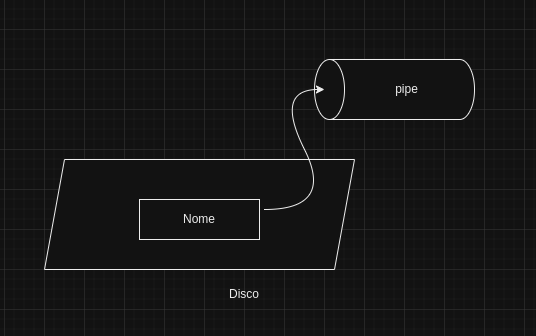
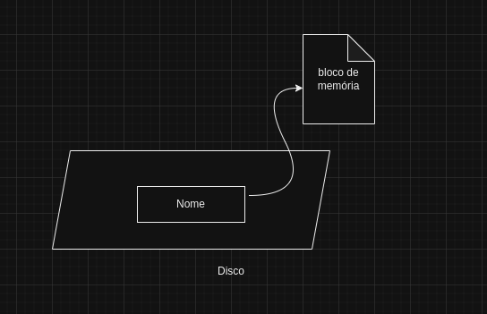
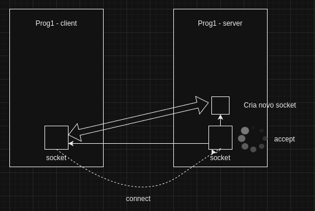
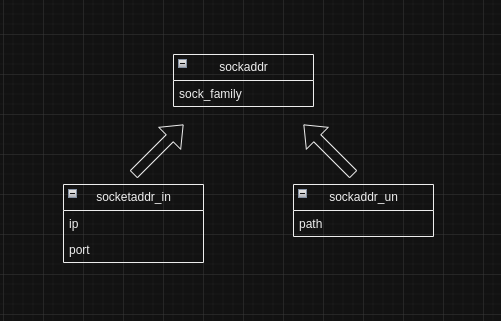
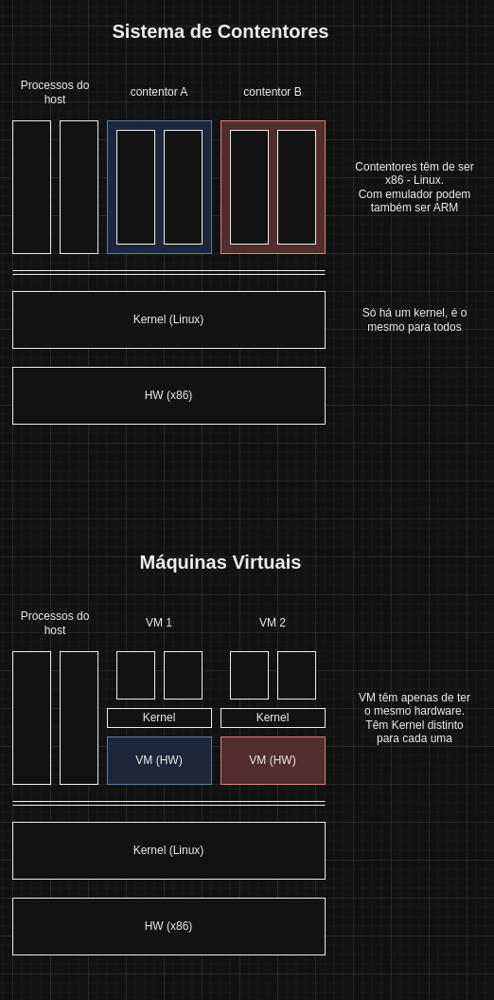
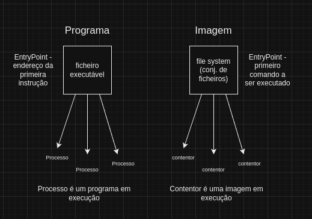
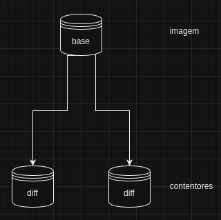
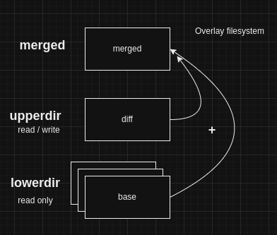
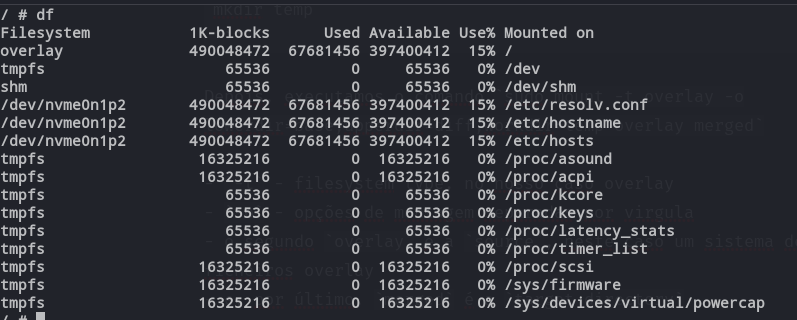

# Part 2

## 11NOV2024 - Mecanismos de comunicação entre processos UNIX

- Mecanismos de comunicação entre processos
- Como funciona a gestão da parte do sistema operativo que trabalha em **user mode**
- Modos de virtualização e elementos de virtualização que podemos usar nos nossos sistemas

### Formas dos processos poderem comunicar entre si:

- **pipe** (anonymous) - comunicação entre processos hierarquicamente relacionados
- **mapeamento de ficheiros em memória** - não há sincronização entre processos que partilham dados nesta zona
- **sockets** - exagerado para a comunicação dentro da mesma máquina
 
### Mecanismos usados em UNIX, baseados nos processos acima que resolvem os problemas dos mesmos:

- **fifo** (named pipe) - igual ao *pipe* mas tem um nome. É necessário fazer `open()`
- **shm** (shared memory) - tipo `mmap` mas com nome e que pode ser partilhado entre vários ficheiros
- **uds** (UNIX Domain Socket) - socket específico para comunicação entre processos
 
Todos estes mecanismos resolvem o pproblema do nome da mesma forma, são nomes no sistema de ficheiros, são **UNIX files**

- **-** ficheiro normal, inclui `shm`
- **d** directoria (mapa de ficheiros)
- **c** char file (I/O byte a byte - ex. porta serie)
- **b** char file (I/O bloco a bloco - ex. disco rigido)
- **l** symbolik link (atalho)
- **s** socket, inclui `uds`
- **p** pipe, inclui `fifo` 

### mkfifo

`int mkfifo(const char *pathname)`

`mkfifo [name]` - utilitario unix, cria um *named pipe*

 

### shm

- vão aparecer em `/dev/shm`
- são apagados cada vez que é feito reboot à máquina
- necessitam a montagem de um arsenal de sincronização
- tem problemas com *pointers*, têm de ter um offset em vez de um endereço



Exemplo:

```c
// Include the necessary headers

int main() {
    const char *name = "/my_shared_memory";
    int shm_fd = shm_open(name, O_CREAT | O_RDWR, 0666);
    if (shm_fd == -1) {
        perror("shm_open");
        return 1;
    }

    // Set the size of the shared memory region
    size_t size = 1024;

    // Resize the shared memory object to the desired size
    if (ftruncate(shm_fd, size) == -1) {
        perror("ftruncate");
        return 1;
    }

    // Map the shared memory object into the process address space
    void *ptr = mmap(NULL, size, PROT_READ | PROT_WRITE, MAP_SHARED, shm_fd, 0);
    if (ptr == MAP_FAILED) {
        perror("mmap");
        return 1;
    }

    // Write data to the shared memory
    sprintf(ptr, "Hello, shared memory!");

    // Print the contents of the shared memory
    printf("Shared memory contents: %s\n", (char *)ptr);

    // Unmap the shared memory object
    if (munmap(ptr, size) == -1) {
        perror("munmap");
        return 1;
    }

    // Close the shared memory file descriptor
    if (close(shm_fd) == -1) {
        perror("close");
        return 1;
    }

    // Unlink the shared memory object
    if (shm_unlink(name) == -1) {
        perror("shm_unlink");
        return 1;
    }

    return 0;
}
```

 ###  uds

Existem sockets de dois tipos:

- stream - ideia de ligação, bytes por orderm (TCP)
- datagram - ideia de endereços, enviam-se mensagens soltas (UDP)



#### socket family



## 12NOV2024 - Linix init systems

- **daemon** - processo ou família de processos relacionados que estão a resolver um determinado problema

### Init em Linux

#### systemVinit vs systemd

##### systemVinit

- Tudo scripts shell em directorias numeradas
- O que arranca primeiro está na directoria **1**, depois, o que está na directoria **2** e assim sucessivamente

##### systemd

- Replica o **launchd** da **apple**
- Objetivos, arrancar menos e arrancar mais em paralelo
- Se há serviços que necessitam de sockets, criar apenas os sockets, o serviço é criado à posteriori aquando da escrita no socket
- Não usa scripts bash, para não criar processos
- Usa ficheiros de configuração chamados **unit files**
- Permite a interação através de um cliente, **systemctl**
- Permite visualização de logs através de **journalctl**
- - [*post*](https://0pointer.de/blog/projects/systemd.html) do criador do systemd

### systemd

- `systemctl` - lista as units que estão disponíveis na máquina
    * devices
    * mounts
    * cpus.path
    * services
    * slices
    * sockets
    * targets - agrupamentos de unidades. (podem corresponder a níveis de operacionalidade)

- `systemctl list-dependencies basic.target`
- `sudo systemctl isolate multi-user.target`
- os ficheiros de configuração da máquina podem ser encontrados em:
    * `/lib/systemd/system -> /usr/lib/...`
    * `/etc/systemd/system`
    * `/run/` - unidades em runtime
    * `/home` - unidades apenas do user

- `systemd` procura primeiro no `/etc` e só depois em `/lib`. `/lib` é mais generalista.

## 19NOV2024 - Systemd Unit Files

### Unit Files

```service
[Unit]
Description=TVS Control Application
Requires=tvsctld.socket
After=tvsctld.socket

[Service]
ExecStart=/opt/isel/tvs/tvsctld/bin/tvsctld
Restart=no

[Install]
Also=tvsctld.socket
```

- Unit - coisas gerais sobre a unidade
    * Requires - dependências obrigatórias
    * Wants - dependências opcionais (se os serviços estiverem presentes na máquina devem arrancar antes deste serviço)
    * After - indicação relativa à ordem de arranque / ativação do sistema
- Service - especificações próprias do serviço
- Install - target necessário para correr o serviço
    * WantedBy - associa o serviço a um target, ex m̀ulti-user.tagert`
    * Also - indica que o se tentarem fazer enable ao serviço este manda fazer enable ao aqui indicado

## 27NOV2024 - Virtualização e Sistemas de Contentores

Sistemas de contentores nascem de um conjunto de iniciativas para colocar programas a funcionar com um isolamento superior aquele que o sistema operativo proporciona.

O isolamento por **processo** isola a memória e controla os CPUs através da ideia de *thread*. E o isolamento acaba aqui. O *file system* é o mesmo para todos os processos. Os recursos de rede também podem entrar em conflito, por exemplo, dois serviços configurados para usar o mesmo porto, faz com que o segundo, dẽ erro e não arranque - porto indisponível.

Como tal, foi-se ao longo do tempo, tentando arranjar formas de aumentar o isolamento. por exemplo, o `chroot` em Linux que cria um ambiente isolado do *file system*, alterando a pasta `/` para uma nova pasta especificada. Programas que correm aqui, só vêm o *file system* a partir desta localização para baixo.

Também já se começou a usar virtualização da rede. há processos, por exemplo, que julgam que a máquina tem um *hostname* diferente.

**Docker** e outros mecanismos de contentores, tiram partido destas técnicas de isolamento para simular que estão numa máquina diferente. 



Assim como um ficheiro executável tem a imagem de um programa e é possível correr isoladamente várias instâncias do programa, num sistema de contentores, podemos correr isoladamente vários contentores referentes à mesma imagem. Podemos dizer que o contentor está para a imagem assim como o processo está para o programa. 



### Docker

Alguns comandos docker:

- `docker pull archlinux`- faz download da imagem archlinux
- `docker images` - listas as imagens instaladas no sistema
- `docker run ubuntu` - cria e corre um contentor ubuntu
- `docker run -t ubuntu` - run com acesso ao terminal (stdout)
- `docker run -it ubuntu` - run com acesso ao terminal e com stdin
- `docker ps -a` - mostra os contentores que estão a correr e os parados (-a --all). só ps mostra apenas os que estão a correr
- `docker start archlinux -ai` - corre um ou mais contentores parados com stdout/stdin (-a --attach) e interatividade (-i)
- `docker build -t tvs51n1 [Dockerfile directory]` - constroi uma imagem docker com o nome (tag) tvs51n1
- `docker run -it tvs51n1 /bin/bash` - run com substituição do [CMD] por /bin/bash
- `docker exec -it [nome do contentor] /bin/bash` - permite executar um comando (neste caso /bin/bash) no contentor a correr
- `docker prune [contentor]` - remove o contentor
- `docker run tvsapp -p 12345:12345` - run tvsapp expondo o porto interno 12345 para a máquina no porto 12345

No mundo docker chama-se sistema operativo ao *ambiente de execução*, tudo o que constitui o sistema operativo excepto o *kernel*

Cada contentor a correr tem um *file system* de **diff** que contem apenas aquilo que foi alterado em relação à imagem original (base)



Contentores não são máquinas virtuais, são processos que correm num ambiente isolado de execução, com sistema de ficheiros limitado

#### Construção de imagens docker


- uma imagem é constituída por dois componentes
    * file system
    * meta dados / meta informação
- é construida através de instruções num ficheiro Dockerfile
- a primeira instrução de um Dockerfile é "em que imagem a nossa imagem se basea"
    * existe uma base vazia chamada **scratch**, `FROM scratch` 
- normamente é usado um `ENTRYPOINT` vazio que é concatenado com `CMD`, onde metemos o comando que queremos correr
    * `CMD` pode ser substituido em run, `ENTRYPOINT` não pode ser substituido
- pode ser necessário forçar o `build` porque o docker quando faz `build` aproveita *cache* de *builds* anteriores
- o último *user* usado no Dockerfile é o que fica como *user* da *image*

#### Exemplo Dockerfile

```Dockerfile
FROM       ubuntu
LABEL      org.opencontainers.image.author="joao.trindade@isel.pt"
USER       root
RUN        apt-get -qq -y update && \
	        apt-get upgrade && \
	        apt-get -y autoclean && \
	        apt-get -y autoremove && \
           run -rf /var/lib/apt/list/*

# create user tvs
RUN        useradd -m tvs && \
           cp /root/.bashrc /home/tvs/ && \
           mkdir /home/tvs/work && \
           chown -R --from=root tvs /home/tvs
ENV	    HOME=/home/tvs
WORKDIR    ${HOME}/work
USER	    tvs
ENTRYPOINT [""]
CMD	    ["/bin/sh"]  			
```

### 04DEC2024

#### Redes docker

É possível associar um contentor a uma 'visão de rede'. Para isso é necesário criar primeiro essa rede. Existem vários tipos (drivers) de redes no docker:

- **null** - sem rede
- **host** - rede do host
- **bridge** - rede default (uma espécie de NAT entre a rede do host e a rede docker)
- ouros - ex. alterar MAC address, redes que ligam diferentes dockerd em máquinas distintas, etc.

Para cada 'solução docker' (conhunto de containers relacionados entre si) deve ser criada uma rede isolada para que a rede docker não misture as várias soluções na mesma rede.

- ```docker network ls``` - lista as redes (iniciais) do docker
- ```docker network create [nome da rede] -- driver bridge``` - cria uma rede do tipo bridge mas diferente da bridge default (tem serviço de DNS, no endereço xxx.xxx.xxx.11)
- ```docker run -it --network tvsnet1 busybox```- para correr um contentor numa rede própria
- ```nslookup [container hostname] 127.0.0.11``` - dns resolver no busybox

#### docker compose

Docker compose serve para criar uma solução docker de forma descritiva. Para isso é usado um ficheiro *yaml* com os campos:

- name - o nome da solução
- service - contentores
- networks - a(s) rede(s) usada(s)
- volumes - referencias permanentes e não voláteis para o sistema de ficheiros da máquina (ex. uma base de dados)

Exemplo:

```yaml
name: "tvs"

services:
	entry:
		build:
			context: ./nginx
		depends_on:
			- webapp
		 ports:
			- "2024:2024"
		netwoks:
			- frontnet
	webapp:
		build:
			context: ./webapp
		depends_on:
			- storage
		environment:
			- ELASTIC_URL=http://tvs-storage-1:9200
		networks:
			- frontnet
			- backnet
	storage:
		image: elasticsearch:8.16.1
		environment
			- discovery.type=single-node
			- xpack.security.enable=false
		volumes:
			esdata:/usr/share/elasticsearch/data
		networks:
			backnet

volumes:
	esdata:
		driver: local

networks:
	frontnet: {}
	backnet: {}
```

**Comandos**

- ```docker compose up -d``` - build and run the solution
- ```docker compose up -d --build```- force rebuild and run the solution
- ```docker compose down``` - stop the solution
- ```docker compose up -d --scale webapp=3 --no-recreate```- run the solution with 3 instances of the service webapp
- ```seq 32 | xargs -I{} curl -s http://localhost:2024/ | grep "HOST" | sed "s/<\/\?[a-z]\+>//g" | sed "s/^[[:space:]]*//" | sort | uniq -c``` - check how many webapps are running


## 11DEC2024 - Overlay filesystems, Namespaces and WSL (windows subsystem linux)

### Overlay filesystems

**Overlay Filesystems** em sistemas UNIX são um tipo de sistema de ficheiros que permitem a sobreposição de um sistema de ficheiros sobre outro. permite criar uma visão unificada de múltiplas diretorias, onde as alterações são armazenadas num "upper layer" enquanto o "lower layer" permanece imutável. Isso é útil, por exemplo, para criar ambientes de execução temporários ou para sistemas de arquivos em contentores, onde se deseja manter a integridade dos dados de base e aplicar modificações de forma isolada.



A pasta **merged** é totalmente virtual, quando lhe acedemos e/ou escrevemos, estamos a ler/escrever na **upperdir** ou **lowerdir** (só de leitura).

Para exemplificar este processo, podemos criar numa directoria, quatro directorias:

```sh
mkdir merged
mkdir diff
mkdir base
mkdir temp
```

Depois, executamos o comando `sudo mount -t overlay -o lowerdir=base,upperdir=diff,workdir=temp overlay merged`

- `-t` - filesystem type, no nosso caso overlay 
- `-o` - opções de montagem separadas por virgula
- o segundo `overlay` é a `source`, neste caso um sistema de ficheiros overlay
- e, por último, `merged` é a `target directory`

Dentro da pasta `merged` estão agora as directorias `base` e `diff`

Curiosidade, quando se apaga um ficheiro de um sistema montado por overlay, na pasta `diff` é criado um ficheiro do tipo `character device` mas um inteiro que representa um *driver* ilegal. Exemplo:

```sh
c--------- 2 root root 0, 0 Dec 12 13:58 file.c
```

#### Semelhanças com o Docker

Dentro de `/var/lib/docker/overlay2/` estão as pastas `base` e dentro destas as pastas `diff`.

Dentro de um contentor em execução, se executarmos `df`, vemos que a raiz (/) do sistema está montada com `overlay`



### Namespaces

**Namespaces** em sistemas UNIX são uma característica que permite a criação de ambientes isolados para processos. São usados para segmentar recursos do sistema, oferecendo a ilusão a um processo de que ele é o único a usar esses recursos. Cada namespace pode conter o seu próprio conjunto de recursos, como IDs de processo, redes, montagens de sistema de ficheiros, etc.

Tipos de namespaces:

1. **PID Namespace**:
   - **Isola IDs de processos.** Permite que processos dentro do namespace tenham sua própria numeração de processos (PIDs). Um processo pode ter PID 1 dentro de um namespace de PID, assim como o processo init no sistema principal.
   - **Aplicações:** Principalmente usado em contentores para separar os processos do contentor dos processos no sistema host.

2. **Net Namespace**:
   - **Isola recursos de rede.** Cada namespace de rede tem sua própria *network stack*, incluindo interfaces de rede, tabelas de roteamento, regras de firewall, etc.
   - **Aplicações:** Permite que contentores tenham suas próprias configurações de rede e endereços IP, separados do sistema host.

3. **Mnt Namespace**:
   - **Isola o sistema de ficheiros montado.** Permite que um conjunto de processos veja um sistema de ficheiros diferente do que outro conjunto de processos vê.
   - **Aplicações:** Utilizado para fornecer diferentes visualizações de sistemas de ficheiros para diferentes processos, útil em contentores e ambientes **chroot**.

4. **UTS Namespace**:
   - **Isola o nome do host e o nome de domínio.** Permite que um namespace tenha seu próprio nome de host e nome de domínio, independente do sistema host. UTS é um nome histórico que significa UNIX Time Share.
   - **Aplicações:** Permite que contentores e outros ambientes isolados tenham nomes de host independentes.

5. **IPC Namespace**:
   - **Isola recursos de comunicação interprocessual (IPC).** Cada namespace de IPC tem seu próprio conjunto de filas de mensagens, semáforos e segmentos de memória compartilhada.
   - **Aplicações:** Usado para isolar a comunicação IPC entre contentores ou outros ambientes isolados.

6. **User Namespace**:
   - **Isola IDs de usuário e grupo.** Permite que processos dentro do namespace tenham os seus próprias IDs de usuário e grupo, que podem mapear para IDs diferentes no sistema host.
   - **Aplicações:** Usado para fornecer isolamento de privilégios, permitindo que processos tenham privilégios elevados dentro do namespace sem ter esses privilégios no sistema host.

7. **Cgroup Namespace**:
   - **Isola a visualização das hierarquias de controle de recursos (cgroups).** Cada namespace de cgroup tem sua própria visualização e controle de grupos de controle de recursos (CPU, memória, ....).
   - **Aplicações:** Utilizado para fornecer limites e contabilidade de recursos separados para diferentes conjuntos de processos.

8. **Time Namespace**:
    - **Isola o tempo do sistema.** Permite que os processos dentro do namespace tenham suas próprias visões do tempo do sistema (como relógios de sistema, tempo de boot, etc.).
    - **Aplicações:** Útil para testes e depuração onde se deseja manipular ou testar comportamentos dependentes de tempo sem afetar o sistema inteiro.

Estes namespaces são a base para a tecnologia de contentores, permitindo que cada contentor tenha uma visão isolada e segura dos recursos do sistema, como se fossem sistemas independentes.


Para listar os namespaces do sistema:

```sh
oicnanev@CodePoetry:~$ lsns
        NS TYPE   NPROCS    PID USER     COMMAND
4026531834 time      160   2609 oicnanev /usr/bin/pipewire
4026531835 cgroup    160   2609 oicnanev /usr/bin/pipewire
4026531836 pid       130   2609 oicnanev /usr/bin/pipewire
4026531837 user      127   2609 oicnanev /usr/bin/pipewire
4026531838 uts       160   2609 oicnanev /usr/bin/pipewire
4026531839 ipc       160   2609 oicnanev /usr/bin/pipewire
4026531840 net       137   2609 oicnanev /usr/bin/pipewire
4026531841 mnt       138   2609 oicnanev /usr/bin/pipewire
4026532842 user       21 626827 oicnanev /opt/vivaldi/vivaldi-bin --type=zygote --string-annotations --crashpad-handler
4026532844 pid         1 626874 oicnanev /opt/vivaldi/vivaldi-bin --type=utility --utility-sub-type=storage.mojom.Stora
4026532845 pid         1 633332 oicnanev /opt/vivaldi/vivaldi-bin --type=renderer --string-annotations --crashpad-handl
4026532847 pid         2 626827 oicnanev /opt/vivaldi/vivaldi-bin --type=zygote --string-annotations --crashpad-handler
4026532848 net        21 626827 oicnanev /opt/vivaldi/vivaldi-bin --type=zygote --string-annotations --crashpad-handler
4026532972 mnt         0        root     
4026532973 pid         1 629078 oicnanev /opt/vivaldi/vivaldi-bin --type=renderer --string-annotations --crashpad-handl
4026532975 pid         1 659600 oicnanev /opt/vivaldi/vivaldi-bin --type=renderer --string-annotations --crashpad-handl
4026533035 mnt         0        root     
4026533042 pid         1 626892 oicnanev /opt/vivaldi/vivaldi-bin --type=renderer --string-annotations --crashpad-handl
4026533043 pid         1 626922 oicnanev /opt/vivaldi/vivaldi-bin --type=renderer --string-annotations --crashpad-handl
4026533044 pid         1 631515 oicnanev /opt/vivaldi/vivaldi-bin --type=renderer --string-annotations --crashpad-handl
4026533045 user        1 641906 oicnanev xdg-dbus-proxy --args=41
4026533046 pid         1 633466 oicnanev /opt/vivaldi/vivaldi-bin --type=renderer --string-annotations --crashpad-handl
4026533047 pid         1 659661 oicnanev /opt/vivaldi/vivaldi-bin --type=renderer --string-annotations --crashpad-handl
4026533048 pid         1 633397 oicnanev /opt/vivaldi/vivaldi-bin --type=renderer --string-annotations --crashpad-handl
4026533050 pid         1 633416 oicnanev /opt/vivaldi/vivaldi-bin --type=renderer --string-annotations --crashpad-handl
4026533051 pid         1 633486 oicnanev /opt/vivaldi/vivaldi-bin --type=renderer --string-annotations --crashpad-handl
4026533054 pid         1 633500 oicnanev /opt/vivaldi/vivaldi-bin --type=renderer --string-annotations --crashpad-handl
4026533055 mnt         1 641906 oicnanev xdg-dbus-proxy --args=41
4026533058 mnt         7 641910 oicnanev bwrap --args 38 -- apostrophe
4026533059 pid         7 641910 oicnanev bwrap --args 38 -- apostrophe
4026533060 user       10 641910 oicnanev bwrap --args 38 -- apostrophe
4026533061 mnt         2 642018 oicnanev ├─bwrap --args 41 -- /usr/libexec/webkitgtk-6.0/WebKitWebProcess 11 44 47
4026533064 net         2 642018 oicnanev ├─bwrap --args 41 -- /usr/libexec/webkitgtk-6.0/WebKitWebProcess 11 44 47
4026533129 pid         2 642018 oicnanev └─bwrap --args 41 -- /usr/libexec/webkitgtk-6.0/WebKitWebProcess 11 44 47
4026533062 user        1 642013 oicnanev xdg-dbus-proxy --args=40
4026533063 mnt         1 642013 oicnanev xdg-dbus-proxy --args=40
4026533098 mnt         2   3295 oicnanev /snap/snapd-desktop-integration/253/usr/bin/snapd-desktop-integration
4026533099 mnt         0        root     
4026533100 mnt         9   3756 oicnanev /snap/spotify/81/usr/share/spotify/spotify
4026533130 pid         1 654036 oicnanev /opt/vivaldi/vivaldi-bin --type=renderer --string-annotations --crashpad-handl
4026533131 pid         1 659689 oicnanev /opt/vivaldi/vivaldi-bin --type=renderer --string-annotations --crashpad-handl
4026533132 pid         1 659171 oicnanev /opt/vivaldi/vivaldi-bin --type=renderer --string-annotations --crashpad-handl
4026533133 pid         1 659692 oicnanev /opt/vivaldi/vivaldi-bin --type=renderer --string-annotations --crashpad-handl
4026533328 pid         1 677609 oicnanev /opt/vivaldi/vivaldi-bin --type=renderer --string-annotations --crashpad-handl
4026533329 pid         1 680009 oicnanev /opt/vivaldi/vivaldi-bin --type=renderer --string-annotations --crashpad-handl
```

O comando `sudo lsns` mostra-nos ainda mais namespaces

Para nos associarmos a um namespace:

```sh
sudo nsenter -t 12567 -u -p -m
``` 

- `-t 12567` pid de um contentor por exemplo
- `-u` uts (hostname, domain name)
- `-p` pid (nunca usar sem usar também o -m)
- `-m` mnt filesystem

Também podemos usar `sudo nsenter -t 12567 -a /bin/sh`, equivalente a `docker exec -it [container] /bin/sh`

Podemos criar os nossos namespaces, exemplo:

```sh
uptime -s
2024-12-11 09:17:27

sudo unshare -T --boottime 1597795200
uptime -s
1974-04-25 10:17:27
```

### WSL - Windows Subsystem Linux

Windows começou com o **DOS**. Disk Operating System, que não era bem um sistema operativo, só corria um programa de cada vez.

Depois, com o Windows NT (New Technology), desenvolvido por [Dave Cutler](https://en.wikipedia.org/wiki/Dave_Cutler), cria-se um sistema operativo de ambiente gráfico de raiz. No entanto, para poder concorrer aos concursos públicos dos USA, teve de criar uma interface POSIX. Por exemplo Windows, não tem a operação `fork()`


Por volta de 2010, o windows retirou o suporte aos subsistemas, entretanto com o aparecimento da tecnologia docker, a Microsoft, decide ressuscitar os subsistemas, com uma API linux.

Na sua primeira versão, o WSL 1, era igual ao subsystem do Windows NT. Por cima do Kernel windows, existe uma API que traduz todas as system calls Linux para system calls windows. Cada vez que o Linux evolui, é necessário evoluir / atualizar também este sistema de tradução de system calls, o que acabou por não ser viável.

- Processos Windows em Programas Linux

Na versão atual, WSL 2, foi introduzido a tecnologia **Hyper-V**, a qual acenta entre a camada de Hardware e o Kernel. Neste caso o Windows usa então por cima desta 2 kerneis, um Windows e outro Linux. Já não é necessária a tradução dos system calls, estes são feitos diretamente ao kernel linux.

- Processos Linux em Programas Linux

#### Comandos wsl para windows shell com privilégios de administrador

- `vmsdiag list` - mostra as VMs a correr no windows. Não há possibilidade de ter várias imagens do mesmo SO como no docker
- `wsl --list -v` - mostra subsistemas WSL instalados e a sua versão (`-v`) que pode ser WSL1 ou WSL2
- `wsl --debug-shell` - shell do sistema base que está a suportar o WSL.

#### Pasta do sistema onde estão os WSL

`C:\$USER\AppData\Local\Packages\CanonicalGroup\LocalState\ext4.vldx` - para WSL2, neste caso Ubuntu e com máquina virtual (vldx)

`C:\USER\AppData\Local\Packages\CanonicalGroup\LocalState\rootfs` - para WSL1, não é uma máquina virtual

## Hypervisores


