# Class Notes

## 10SET24

### Enquadramento da disciplina no curso
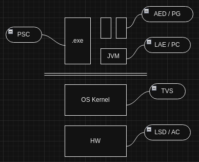

| Semestre | Disciplina |
| -------- | -----------|
| 1º | PG, LSD |
| 2º | AC. AED |
| 3º | PSC |
| 4º | PC, LAE |
| 5º | TVS |

### Sylabus

| Tópico | Trabalho |
| ------ | -------- |
| **1. Sistemas operativos, processos, etc.** | CW1 |
| **2. Proteção de Hardware** | CW2 |
| Feedback #1 | 28..31 out |
| **Teste parcial 1** | 5nov ou 12nov |
| **3. Serviços, Hipervisores, Emuladores** | CW3 |
| **4. Contentores** | CW4 |
| Feedback #2 | 17..20 dez |
| **Teste parcial/ EN** | 6..18 jan |


## 11SET24

#### Sumário
- Taxonomia da Virtualização
- Processos dos Sistemas Operativos como Ambientes Virtuais de Execução
- Arquitetura Geral de um Sistema Operativo

### Virtualização
- Emulação, extensão ou modificação do comportamento de um objecto computacional (físico) através de *software*
- Virtualização do ambiente de execução, como exemplo a JVM

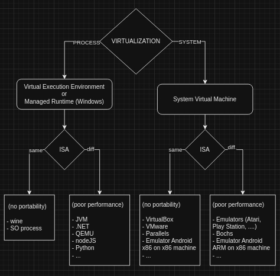

### Processo
- Representação estática de programa em execução.
- Entidade administrativa do SO responsável pelo programa em execução.
- Representa um programa que está a correr, espaço em memória... Programa em funcionamento.
- Com o surgimento do UNIX em 1969/70 foi criado o conceito de acesso à memória por segmentação para virtualizar a memória. O espaço de memória de cada processo tem uma **base** corespondente na memória física. O **espaço de endereçamento virtual** é único por processo.
- Cada processo tem um CPU virtual na forma de uma **thread**. Cada processo pode ter uma ou mais threads.
- Cada processo tem uma **tabela de sessão** sobre *files*. Em UNIX, tudo o que seja passível de operações Input/Output é designado por *file*; em Windows, estas files são chamadas de objectos do sistema. *File* pode ser um ficheiro texto, uma directoria ou uma ligação à internet.

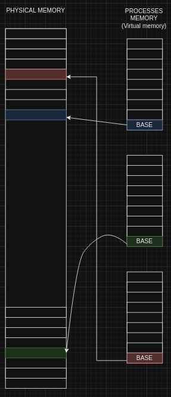

### Arquitectura de um Sistema Operativo

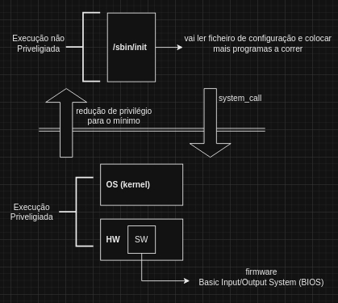

#### Sistema Operativo
- Kernel do SO
- Ambiente de Operação
    * Operation Environment
    * Programas necessários para o funcionamento do S.O., ex: dir/ls

#### Níveis de execução CPU x86
| # | Privilégio |
| -- | ---------- |
| 0 | Maior privilégio |
| 1 |   |
| 2 |   |
| 3 | Menor privilégio - algumas instruções não são aceitáveis

## 17SET24

### Ambiente virtual para a disciplina

(L)Ubuntu 24.04 LTS

- Imagem VirtualBox x86
- WSL 2 com Ubuntu 24.04
 	* Windows Subsystem Linux
 	* Começou nos anos 80 por exigência do governo USA de suporte a aplicações que usavam sistemas *Posix*
 	* Atualmente, *Microsoft* volta a investir em subsistemas devido provavelmente ao sucesso do *Docker*
 	* Usa uma máquina virtual oculta dentro do *Windows*
 	* Distribui o **kernel** *Linux* dentro do *Windows*

> Em Linux para vermos qual a distribuição usada executar o seguinte comando: ```cat /etc/os-release```

> Em Windows para aceder ao *file system* do subsistema linux, escrever na barra do *Explorador do Windows*: ```\\wsl$\<nome_da_imagem>```

### Processo - File Descriptor Table
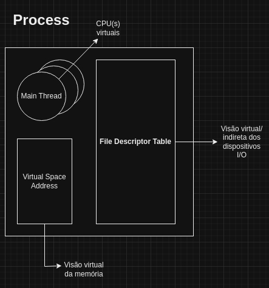

Todas as informações administrativas dos processos estão do lado do **kernel**

**File Descriptor Table** - cada processo tem as suas sessões (acessos a *files*). Cada sessão é identificada por um *index*, 0...X.
**File** - ficheiro, em *Linux*, qualquer entidade que permita **Input/Output**. Em Windows, existem ainda outros objectos do sistema que não permitem I/O como semáforos, enventos, etc. Em Windows, estas entradas não são identificadas por *index* mas sim por um *handle*, uma espécie de mapa em que cada vez que um processo é criado, para interagir com um objecto do sistema, recebe uma 'chave'. 

> A *file* is a sequence of bytes, nothing more and nothing less. Every I/O device, including disks, keyboards, displays, and even networks, is modeled as a file. All input and output in the system is performed by reading and writing files, using a small set of system calls known as Unix I/O. - Computer Systems a Programmers Perspective, Chapter 1.7.4 Files.

### Operações de I/O implementadas pelo Sistema Operativo

O sistema operativo UNIX foi construído com umas regras muito simples mas que dão muito trabalho a cumprir. Exemplo disso, é na linguagem C, as funções ```maloc``` e ```free```, ao invés do *garbage colector* de linguagens mais recentes.

Para efetuar operações de I/O é necessário passar de **user mode** para **kernel mode**, e os Sistemas Operativos, bem como a linguagem C, implementam de forma diferente essas funções.
  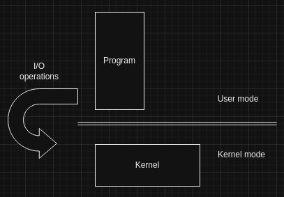

| C function | UNIX (Posix) | Windows | Description |
| ---------- | ------------ | ------- | ----------- |
| fopen | open | CreateFile | Pedir acesso |
| fread | read | ReadFile | Ler dados (input) |
| fwrite | write | WriteFile | Escrever dados (output) |
| fclose | close | CloseHandle | Terminar acesso |
| ioctl(?) | ioctl | DeviceIoControl | Configurações gerais, ex:. set comunication baudrate |  

#### UNIX File Descriptor Table Default Index Allocation
| index # | Default allocation |
| ------- | ------------------ |
| 0 | stdin |
| 1 | stdout |
| 2 | stderr |

Em C, **stderr** é como que um "embrulho" da biblioteca que faz chegar dados ao *index* 2 do *File Descriptor Table* do programa em questão. Para imprimir o erro, usar a função ```perror("error user message");``` imprime a mensagem escolhida pelo programador acrescida do código de erro do sistema operativo.

Para alterar o *index* por defeito do *File Descriptor Table*:
```terminal
./prog output.txt 1> myStdout.txt
```
Neste exemplo, redirecionamos o stdout do *index* 1 para o ficheiro "myStdout.txt". "output.txt" é um parâmetro do programa "prog".
Também é possível redirecionar os outros *index*, "stdin"" e "stderr".

> Código exemplo da aula, criação de um **file descriptor** que remete para um ficheiro no *index* 3. [prog01-files.c](../ClassCode/01-files/prog01-files.c)

### Permissões em UNIX

| owner | group | others |     |
| ----- | ----- | ------ | --- |
| rwx | rwx | rwx | read/write/execute |
| 110 | 100 | 100 | notação binária |
| 6	 | 4 | 4 | notação octal |

Notação em C:
- **644** - decimal
- **0644** - octal
- **0x644** - hexadecimal	

Quando executamos ```ls -l``` em Linux ou apenas ```ll``` em Ubuntu, a listagem que aparece mostra:
- tipo de ficheiro, permissões dono, permissoes grupo e permissões outros
- dono
- grupo
- tamanho
- data de criação
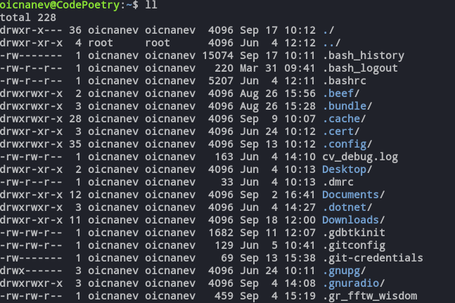

#### Tipos de ficheiros oficiais em UNIX

Em Linux, o tipo de ficheiro é identificado por um caractere específico. Os oficiais são:

 - **Ficheiro Regular (-)**: Representa ficheiros comuns, como documentos, scripts e programas executáveis.
 - **Diretoria (d)**: Representa diretórios que contêm outros ficheiros.
 - **Link Simbólico (l)**: Representa links simbólicos que apontam para outros ficheiros ou diretórios.
 - **Ficheiro de Dispositivo de Caractere (c)**: Representa dispositivos que manipulam dados como caracteres (bytes), como teclados e ratos.
 - **Ficheiro de Dispositivo de Bloco (b)**: Representa dispositivos que manipulam dados em blocos, como discos rígidos.
 - **Socket (s)**: Utilizado para comunicação entre processos, permitindo a troca de dados.
 - **FIFO (Named Pipe) (p)**: Utilizado para comunicação entre processos, operando em uma base de primeiro a entrar, primeiro a sair (FIFO).

## 18SET2024

### Atributos do processo em UNIX
- **pid** - Process Identifier
- **ppid** - Parent pid
- **user** - owner
- **exit code** - valor númerico retornado após término
   
> Processo nº1 em UNIX - ```/sbin/init```

#### Comandos UNIX para listar processos em execução

- **ps -aux**
  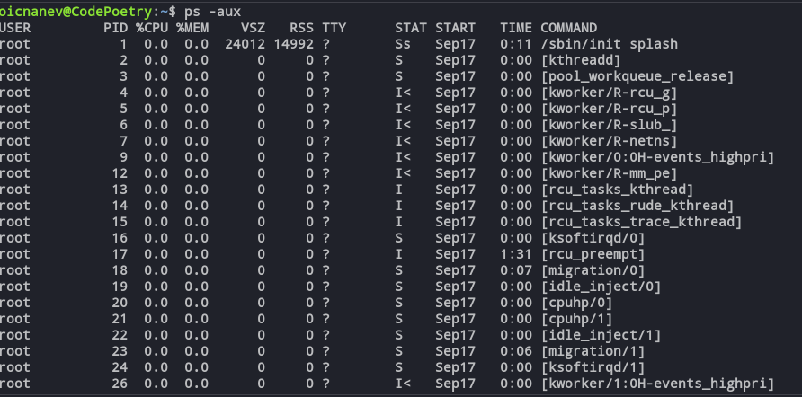
- **htop**
  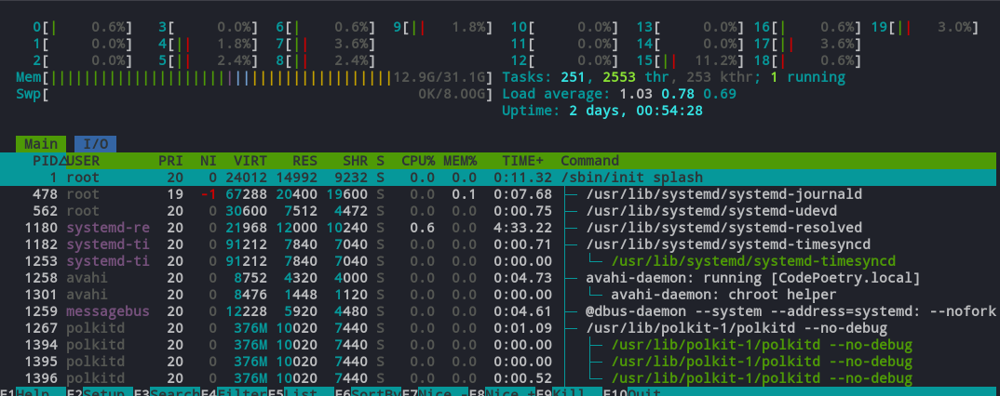
- **btop**
  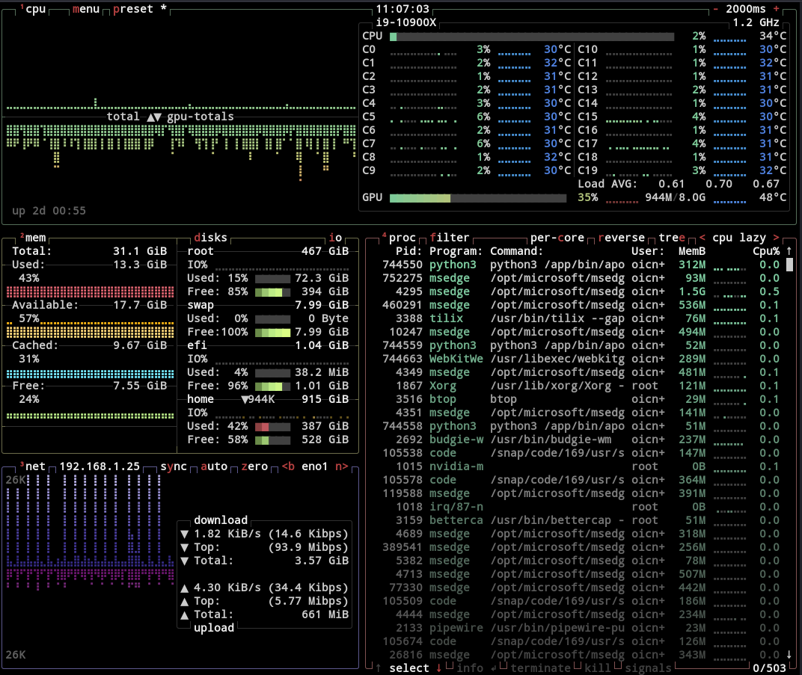

#### Exit code 
No Unix, o **exit code** (ou código de saída) é um valor numérico retornado por um processo quando termina. Este valor é usado para indicar se o processo foi concluído com sucesso ou se ocorreu algum erro. 

- **Exit Code**: É o valor numérico retornado por um processo ao terminar. Por convenção, um exit code de 0 indica que o processo foi concluído com sucesso, enquanto qualquer valor diferente de 0 indica que ocorreu um erro.
- **Exit Status**: É o estado final do processo, representado pelo exit code. Pode ser verificado usando a variável especial ```$?``` na shell, que armazena o exit code do último comando executado.
- **Exited**: Refere-se ao estado de um processo que terminou sua execução. Quando um processo “exits”, ele retorna um exit code ao sistema operacional.
- **Terminated**: Indica que um processo foi encerrado. Isso pode ocorrer de forma normal (quando o processo completa sua tarefa e retorna um exit code) ou anormal (quando o processo é interrompido por um sinal, como ```SIGINT``` ou ```SIGTERM```).


Alguns códigos comuns que ajudam a identificar rapidamente o motivo pelo qual um processo terminou e são essenciais para depuração e controle de fluxo em scripts e programas:

| Exit Code | Significado |
| --------- | ----------- |
| 0 | Sucesso (o comando foi executado sem erros) |
| 1 | Erro genérico |
| 2 | Uso incorreto do comando ou argumento |
| 126 | Permissão negada ou incapaz de executar |
| 127 | Comando não encontrado |
| 128+n | O comando foi terminado por um sinal (onde n é o número do sinal) |
| 130 | Terminado por Ctrl+C (sinal SIGINT) |
| 143 | Terminado por SIGTERM |

### Criação de processos programáticamente

Em **Windows** temos a função [CreateProcessA](https://learn.microsoft.com/en-us/windows/win32/api/processthreadsapi/nf-processthreadsapi-createprocessa). É composto por 10 parâmetros sendo que o único obrigatorio é o *lpApplicationName* ou *lpCommandLine*.

Em **UNIX** existem 2 funções, **fork()** e **exec\[\]\(...,...,....\)**

#### fork()
A função ```fork()``` é usada para criar um novo processo, chamado de processo filho. O processo filho é cópia quase exata do processo pai, exepto algumas diferenças como o pid e ppid.
- **Criação do Processo** - cria um novo processo que é cópia exata do processo que a chamou (processo corrente).
- **Retorno** - retorna duas vezes: uma vez no processo pai (com o pid do filho) e uma vez no processo filho (com 0). Se houver um erro, retorna -1 no processo pai.
- **Execução Paralela** - Após a chamada ```fork()```, tanto o processo pai quanto o processo filho continuam em execução a partir do ponto onde o ```fork()``` foi chamado.
- **Perda de parentalidade** - Caso o processo pai termine, o ppid do filho altera para um processo que esteja a correr.
- **Chamada ```wait()``` ou ```waitpid()```** - após chamar o ```fork()``` é necessário chamar uma destas funções por várias razões:
    * **Evitar processos zombies** - quando um processo filho termina, ele entra em um estado chamado “zombie” até que o processo pai leia seu status de término. Se o processo pai não chamar ```wait()``` ou ```waitpid()```, o processo filho permanecerá como zombie, ocupando uma entrada na tabela de processos do sistema. Isso pode eventualmente levar ao esgotamento dos recursos do sistema, caso  muitos processos zumbis se acumulem.
    * **Sincronização** - Permite que o processo pai se sincroniza com o processo filho, para que não termine enquanto o processo filho não tenha terminado também.
    * **Recuperação do exit code** - Permite ao processo pai verificar se o processo filho terminou com sucesso ou ocorreu algum erro.
    * **Gestão de recursos** - Ao chamar ```wait()``` ou ```waitpid()```, o processo pai pode liberar os recursos associados ao processo filho. Isso pode incluir a entrada na tabela de processos, bem como, outros recursos do sistema que foram alocados para o processo filho.

> Código de exemplos da aula:

> - fork [prog02-fork.c](../ClassCode/02-fork/prog02-fork.c)
> - waitpid [prog03-waitpid.c](../ClassCode/02-fork/prog03-waitpid.c)
> - same virtual memory space with different physical memory addresses [prog04-procmem.c](../ClassCode/02-fork/prog04-procmem.c)

#### exec()
A família de funções exec() substitui a imagem do processo atual por uma nova imagem de processo. Isso significa que o código e os dados do processo atual são substituídos pelo código e dados de um novo programa. No âmbito do processo corrente, destroi a sua representação virtual e cria um novo, no entanto reutiliza a sua tabela de descritores de ficheiros.

- **Substituição de Processos**: ```exec()``` carrega um novo programa no espaço de endereço do processo que o chama e começa a executá-lo.
- **Família de Funções**: Existem várias variantes de ```exec()``` que diferem na forma como os argumentos e o ambiente são passados para o novo programa, como:
	- ```execl()``` - usar quando sabemos o número de parãmetros a usar no processo novo. **l** de *list*?
	- ```execlp()``` - ao usar o **p**, procura o programa no *path* 
	- ```execle()``` - ao usar o **e**, passa-se um *poiter* para *array* extra com as variáveis de ambiente. **e** de *environment*.  
	- ```execv()``` - 1º arg. é o nome do programa, 2º, um *pointer* para *array* de argumentos que pode ser preenchido dinâmicamente. **v** de *variable_size*?
	- ```execvp()``` - ao usar o **p**, procura o programa no *path* 
	- ```execvpe()``` - ao usar o **e**, passa-se um *poiter* para *array* extra com as variáveis de ambiente. **e** de *environment*
- **Não Retorna**: Se ```exec()``` for bem-sucedido, ele não retorna ao programa que o chamou. Se falhar, ele retorna -1.

> Exemplo da aula:

> - exec [prog05-exec.c](../ClassCode/03-exec/prog05-exec.c)

### Redirecionamentos na shell

| Index | File Descriptor |
| ----- | --------------- |
| 0 | stdin |
| 1 | stdout |
| 2 | stderr |

#### Redirecionamento da saída
```terminal
comando 1> output.txt
```

#### Redirecionamento da entrada
```terminal
comando 0< input.txt
```

#### Redirecionamento da saída de erros
```terminal
comando 2> error.txt
```

#### Redirecionamento arbitrário
```terminal
comando 88> someFile.txt
```

#### Redirecionamento da saída e erro para o mesmo ficheiro
```terminal
comando &> all.txt
```

#### Exemplo de encadeamento de redirecionamentos
```terminal
input.txt < comando 1> output.txt 2> error.txt 88>something.txt
```

#### Função ```dup2(int oldfd, int newfd)```

É usada para duplicar um *file descriptor*, duplicando o ```oldfd``` para ```newfd```, Se o ```newfd``` já estiver aberto, será encerrado antes de ser reutilizado sem ser necessário chamar ```close()```. Se o ```oldfd``` não for um *file descriptor* válido, a função falha e o ```newfd``` não será encerrado.

> Exemplo de programa que usa **dup2** para fazer *redirection*:

> - redirection with dup2 [prog06-redir.c](../ClassCode/04-redir/prog06-redir.c)


## 24SET2024

### Pipes
**Pipes** são um mecanismo de comunicação entre processos em Unix. Permitem o fluxo unidirecional de dados entre processos, onde um processo escreve dados no *pipe* e outro lê esses dados.

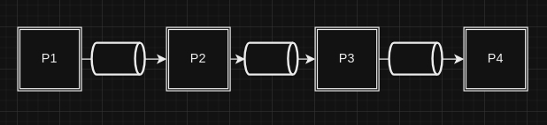

#### Funcionamento do ponto de vista do *Kernel*

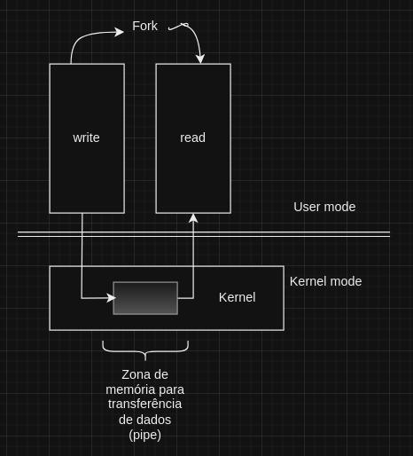

1. **Criação do Pipe**:
    - A operação *pipe* cria um objeto *pipe* na memória do *kernel*, retorna um para de *file descriptors*, um para ler e outro para escrever no *pipe*.
    - O *kernel* utiliza um sistema de ficheiros virtual ```pipefs``` para gerir os *pipes*. Este sistema de ficheirosé montado no espaço do *kernel* durante o *init*.
2. **Buffer de memória**:
    - O *kernel* usa a sua própria memória como *buffer* para transferir dados entre os espaços de endereços do *user* e do *kernel*. Quando um processo escreve dados no *pipe*, o *kernel* copia esses dados do espaço de endereço do *user* para o espaço de endereços do *kernel*. Da mesma forma, quando um processo lê do *pipe*, os dados são copiados do espaço de endereço do *kernel* para o espaço de endereços do *user*.
3. **Chamadas de Sistema**:
    - O *kernel* fornece várias chamadas de sistema para manipular operações de *pipe*, como ```pipe()```, ```read()```, e ```write()```. Essas chamadas garantem o funcionamento adequado dos *pipes* e permitem a transferência eficiente de dados entre processos.

#### Funcionamento do ponto de vista dos Processos
1. **Criação e uso**:
    - Um processo pode criar um *pipe* usando a chamada de sistema ```pipe()```, que retorna dois *file descriptors*: um para leitura e outro para escrita.
    - O processo de escrita 'empurra' dados para o *pipe*, enquanto o processo de leitura 'puxa' dados do outro extremo do *pipe*.
2. **Comunicação entre processos**
    - Os *pipes* são muitas vezes usados para comunicação entre processos pai e filho. Por exemplo, um processo pai pode criar um *pipe* antes de fazer ```fork()```. Após o ```fork()```, tanto o processo pai como o filho herdam os *file descriptors* do *pipe*, permitindo a comunicação entre eles.
3. **Exemplo prático**:
    - Considere uma *shell* que usa *pipes* para ligar a saída de um comando à entrada de outro. A *shell* cria processos filhos para cada comando e usa *pipes* para ligar a saída de um comando à entrada do próximo. Isso é feito configurando os *file descriptors* apropriados antes de chamar ```exec()``` para executar os comandos.
    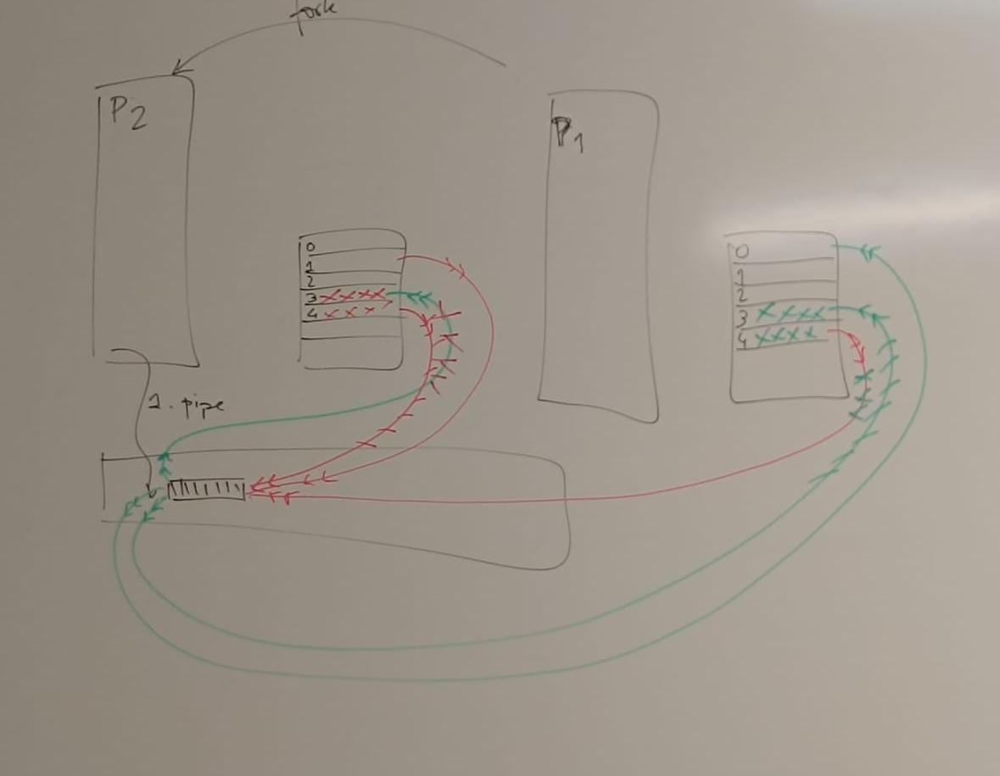
	- Tendo um processo com *file descriptor table*, onde se pede ao *kernel* para criar um *pipe*, vão ser criadas entradas na tabela que serão usads para manipular o mesmo (*pipe*):
	- Entrada 3 - permite ler do *pipe*
	- Entrada 4 - permite escrever do *pipe*
	- Ao fazer ```fork()``` no processo **P1**, criamos outro processo **P2** cuja tabela de *file descriptors* é cópia da tabela do processo pai (**P1**). Ficando assim com duas sessões ativas de leitura sobre o *pipe* e duas sessões de escrita sobre o *pipe*.

> Programas de exemplo do funcionamento dos *pipes*:

>- pipe basic [prog07-pipe-basic.c](../ClassCode/05-pipe/prog07-pipe-basic.c)
>- pipe with fork [prog08-pipe-fork.c](../ClassCode/05-pipe/prog08-pipe-fork.c)
>- pipe with fork, dup2 and exec [prog09-pipe-fork-dup2-exec.c](../ClassCode/05-pipe/prog09-pipe-fork-dup2-exec.c)
	
## 01OUT24

### Signals
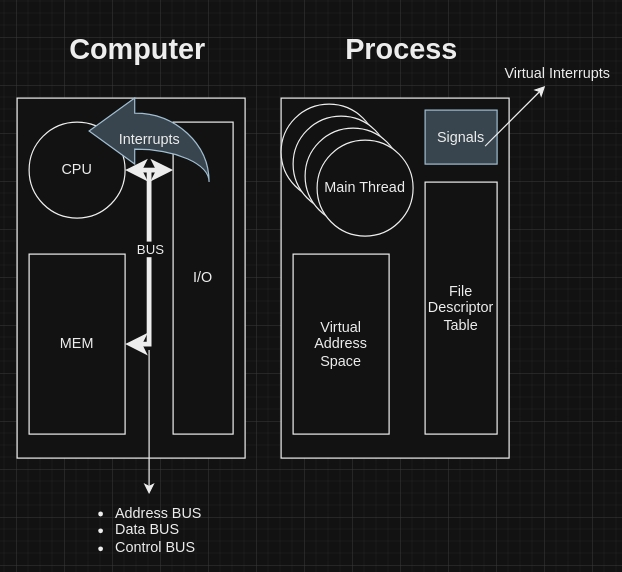

- A iniciativa de ação é sempre do CPU, no entanto, nos sistemas reais existe um mecanismo para dispositivos I/O pedirem CPU - os *interrupts*.
- Existem dispositivos lentos ou dependentes de ações externas o que faz com que a iniciativa do CPU (Polling) se torne ineficiente. (Ex.: CD/DVD, placas de rede, etc.). Os *interrupts* permitem que não seja necessário o *polling* por parte do CPU e este é avisado diretamente pelo dispositivo através do mecanismo de *interrupts*.
- Nos servidores modernos, todas as ligações são assíncronas; é tudo notificado ao CPU através de *interrupts*.
- Como forma de ocultar o funcionamento dos *interrupts*, nas linguagens de programação modernas, começou a surgir o ```async/await``` primariamente no **C#**, depois **JavaScript**, no **Kotlin** são usadas as **corotinas**, no **Java**, as **virtual threads**, etc.
- Em termos de **processos**, existem também notificações assíncronas de forma semelhante aos *interrupts*. Este processo é chamado de *Signals*. O número tipico de sinais (*standard*) por processo são 31, no entanto podem existir mais ou menos. Ver: ```man 7 signal``` em sistemas Unix.
- A forma de trabalhar com os *signals* é em tudo semelhante à forma com que se trabalha com *interrupts*.

#### Signal dispositions
Cada *signal* tem uma *disposition* atual, que determina o seu comportamento do processo quando recebe o mesmo.

As entradas na coluna **Ação** da tabela abaixo, especificam a disposição padrão para cada sinal como:
- **Term** - terminar o processo
- **Ign** - ignorar o sinal, (ex: morte de processo filho)
- **Core** - terminar o processo e guardar informação para *debug*
- **Stop** - pausar (*stop*) o processo
- **Cont** - continuar o processo se o mesmo estiver pausado (*stoped*) no momento.

Um processo pode alterar a disposição de um *signal* através das funções [```sigaction()```](https://www.man7.org/linux/man-pages/man2/sigaction.2.html) ou [```signal()```](https://www.man7.org/linux/man-pages/man2/signal.2.html).

##### Standard Signals
| Signal | Action | Comment |
| ------ | ------ | ------- |
| **SIGABRT** | Core | Abort signal from abort(3) |
| **SIGALRM** | Term | Timer signal from alarm(2) |
| **SIGBUS** | Core | Bus error (bad memory access) |
| **SIGCHLD** | Ign | Child stopped or terminated |
| **SIGCLD** | Ign | A synonym for SIGCHLD |
| **SIGCONT** | Cont | Continue if stopped |
| **SIGEMT** | Term | Emulator trap |
| **SIGFPE** | Core | Floating-point exception |
| **SIGHUP** | Term | Hangup detected on controlling terminal or death of controlling process |
| **SIGILL** | Core | Illegal Instruction |
| **SIGINFO** | | A synonym for SIGPWR |
| **SIGINT** | Term | Interrupt from keyboard |
| **SIGIO** | Term | I/O now possible (4.2BSD) |
| **SIGIOT** | Core | IOT trap. A synonym for SIGABRT |
| **SIGKILL** | Term | Kill signal |
| **SIGLOST** | Term | File lock lost (unused) |
| **SIGPIPE** | Term | Broken pipe: write to pipe with no readers; see pipe(7) |
| **SIGPOLL** | Term | Pollable event (Sys V); synonym for SIGIO |
| **SIGPROF** | Term | Profiling timer expired |
| **SIGPWR** | Term | Power failure (System V) |
| **SIGQUIT** | Core | Quit from keyboard |
| **SIGSEGV** | Core | Invalid memory reference |
| **SIGSTKFLT** | Term | Stack fault on coprocessor (unused) |
| **SIGSTOP** | Stop | Stop process |
| **SIGTSTP** | Stop | Stop typed at terminal |
| **SIGSYS** | Core | Bad system call (SVr4); see also seccomp(2) |
| **SIGTERM** | Term | Termination signal |
| **SIGTRAP** | Core | Trace/breakpoint trap |
| **SIGTTIN** | Stop | Terminal input for background process |
| **SIGTTOU** | Stop | Terminal output for background process |
| **SIGUNUSED** | Core | Synonymous with SIGSYS |
| **SIGURG** | Ign | Urgent condition on socket (4.2BSD) |
| **SIGUSR1** | Term | User-defined signal 1 |
| **SIGUSR2** | Term | User-defined signal 2 |
| **SIGVTALRM** | Term | Virtual alarm clock (4.2BSD) |
| **SIGXCPU** | Core | CPU time limit exceeded (4.2BSD); see setrlimit(2) |
| **SIGXFSZ** | Core | File size limit exceeded (4.2BSD); see setrlimit(2) |
| **SIGWINCH** | Ign | Window resize signal (4.3BSD, Sun) |

Os sinais **SIGKILL** e **SIGSTOP** não permitem ser capturados, bloqueados ou ignorados.

#### Numeração dos *signals* para *standard signals*

| Signal | x86/ARM most others | Alpha/SPARC | MIPS | PARISC | Notes |
| ------ | - | - | - | - | - |
| SIGHUP | 1 | 1 | 1 | 1 |  |
| SIGINT | 2 | 2 | 2 | 2 |  |
| SIGQUIT | 3 | 3 | 3 | 3 |  |
| SIGILL | 4 | 4 | 4 | 4 |  |
| SIGTRAP | 5 | 5 | 5 | 5 |  |
| SIGABRT | 6 | 6 | 6 | 6 |  |
| SIGIOT | 6 | 6 | 6 | 6 |  |
| SIGBUS | 7 | 10 | 10 | 10 |  |
| SIGEMT | - | 7 | 7 | - |  |
| SIGFPE | 8 | 8 | 8 | 8 |  |
| SIGKILL | 9 | 9 | 9 | 9 |  |
| SIGUSR1 | 10 | 30 | 16 | 16 |  |
| SIGSEGV | 11 | 11 | 11 | 11 |  |
| SIGUSR2 | 12 | 31 | 17 | 17 |  |
| SIGPIPE | 13 | 13 | 13 | 13 |  |
| SIGALRM | 14 | 14 | 14 | 14 |  |
| SIGTERM | 15 | 15 | 15 | 15 |  |
| SIGSTKFLT | 16 | - | - | 7 |  |
| SIGCHLD | 17 | 20 | 18 | 18 |  |
| SIGCLD | - | - | 18 | - |  |
| SIGCONT | 18 | 19 | 25 | 26 |  |
| SIGSTOP | 19 | 17 | 23 | 24 |  |
| SIGTSTP | 20 | 18 | 24 | 25 |  |
| SIGTTIN | 21 | 21 | 26 | 27 |  |
| SIGTTOU | 22 | 22 | 27 | 28 |  |
| SIGURG | 23 | 16 | 21 | 29 |  |
| SIGXCPU | 24 | 24 | 30 | 12 |  |
| SIGXFSZ | 25 | 25 | 31 | 30 |  |
| SIGVTALRM | 26 | 26 | 28 | 20 |  |
| SIGPROF | 27 | 27 | 29 | 21 |  |
| SIGWINCH | 28 | 28 | 20 | 23 |  |
| SIGIO | 29 | 23 | 22 | 22 |  |
| SIGPOLL |   |   |   |   | Same as SIGIO |
| SIGPWR | 30 | 29/- | 19 | 19 |  |
| SIGINFO | - | 29/- | - | - |  |
| SIGLOST | - | -/29 | - | - |  |
| SIGSYS | 31 | 12 | 12 | 31 |  |
| SIGUNUSED | 31 | - | - | 31 |  |

Quando temos um processo que termina é possível ver o seu *exit code* através do comando shell ```echo $```. O número retornado, caso seja superior a 128 indica que o processo terminou com um *signal*. Por exemplo, *exit code* = 130, diz-nos que o processo terminou com um *signal* (128) e que este *signal* foi SIGINT (*signal* #2). 128 + 2 = 130.

**ATENÇÂO** ao SIGPIPE - depois dum ```<CTRL>+<C>``` pode existir a tentativa de escrever *file descriptors* que já não existem.

> Exemplos de manipulação dos *signals* programáticamente:

>- Send SIGINT or SIGTERM [sig01.c](../ClassCode/06-signal/sig01.c)
>- SIGALARM terminates program [sig02.c](../ClassCode/06-signal/sig02.c)
>- Change default signal disposition [sig03.c](../ClassCode/06-signal/sig03.c)
>- Set disposition to signal handling function [sig04.c](../ClassCode/06-signal/sig04.c)
>- Set an alarm every second once a procedure receives a SIGTERM. So handling SIGINT and SIGALARM [sig5.c](../ClassCode/06-signal/sig05.c)

## 08OUT24

### Níveis de privilegio que os processadores x86 usam controlo de acesso a segmentos

- O CPU tem um registo chamado **PL** no qual está o *Privilege-Level* em que está a correr.
- Nível 0 - privilégio máximo - kernel corre neste nível
- Nível 3 - privilégio mínimo - user processes correm neste nível
- Níveis 1 e 2 - são usados por *device drivers* e máquinas virtuais (VMWare, VirtualBox, etc.)
- Existe ainda hipervisores que podem ser instalados por baixo do sistema operativo (VMWare ESXi, Citrix XenServer, Microsoft Hyper-V) e que os programadores normalmente dizem que trabalham em nível -1

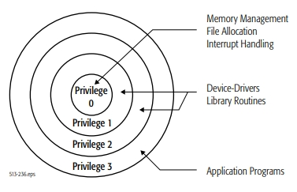

### Arranque e funcionamento do Sistema Operativo do ponto de vista do processador

- CPU arranca sempre com nível de privilégio máximo (PL-0)
- Kernel inicia ainda em privilégio máximo (PL-0)
- Kernel coloca **init** (/sbin/init) em execução (PID=1) e muda para privilégio mínimo (PL-3) - kernel escreve no stack o retorno da interrupção e depois força uma interrupção, esta ao retornar vai para o nível 3
- init chama outros programas e quando tem necessidade faz chamadas ao kernel

### Formas de regressar ao privilégio máximo

- **Chamadas do sistema**
    * solução clássica - interrupção por software, em assembly instrução ```int```
        + Linux - int 0x80
        + Windows - int 0x2E
    * atualmente - através de instrução (assembly):
        + ```sysenter``` / ```sysexit``` para **IA-32**
        + ```syscall``` / ```sysret``` para **AMD-64**
- **Atendimento de interrupções**
- **Excepções** (caso particular de interrupção)

Quando retorna de uma interrupção, o CPU retorna também ao nível de privilégio anterior.

### Handler de interrupções (tabela)

- Tabela normalmente com 256 entradas
- As primeiras 32 entradas são para tratar excepções
- As restantes são para tratar interrupções
- Cada linha tem:
    * endereço do código do kernel para onde se deve saltar
    * nível de privilégio em que o CPU deve ser colocado quando a interrupção acontecer
- O local da memória onde reside esta tabela só é acessível em *kernel mode*

### Memory Management

O CPU tem um registo **CR3** - Control Register 3 que aponta para um dos espaço de endereçamento, o espaço de endereçamento da tread corrente.

Na mesma instrução para alterar a thread atual, também se altera este CR3 para ter o espaço de endereçamento atual 

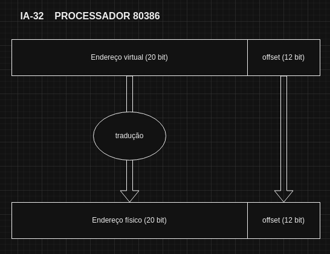

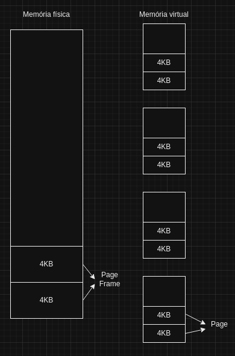

## 09OUT24

### Programação de um "Hello World! em Kernel (Assembly)"

ver código **FALTA**

**Linux System Call Table (excerto)**

| %rax - op. number | System Call | %rdi - arg 0 | %rsi - arg 1 | %rdx - arg 2 |
| ---- | ----------- | ---- | ---- | ---- |
| 0 | sys_read | unsigned int fd | char *buf | size_t count |
| 1 | sys_write | unsigned int fd | const char *buf | size_t count |
| 2 | sys_open | const char \*filename | int flags | int mode |
| 3 | sys_close | unsigned int fd |  |  |
| ... | | | | |

Ver mais [aqui](https://blog.rchapman.org/posts/Linux_System_Call_Table_for_x86_64/)

### Evolução do Memory Management

Com a criação do Processador **80386** em 1985, **IA-32**, a gestão da memória começou a ser feita em blocos de 4KB.

- Temos então endereços físicos até 32 bits -> 2^32^ = 4GB 
- Endereços virtuais de 32 bits -> 2^32^ = 4GB
- Para a página de endereçameto são necessários 4GB / 4KB = 2^32^ / 2^12^ = 1MB
- Temos então que a tradução do endereçamento é feita:
    * **CR3** - Control Registry 3 - no processador que aponta para para o início do PDI
    * **PDI** - Page Directory Index ou Table (manual AMD) - apontado pelos bits 22..31 do *virtual address*, no *address* apontado, está o *address* do PTI
    * **PTI** - Page Table Index - apontado pelos bits 12..21 do *virtual address*, que apontam por fim para o bloco de 4KB da memória física
    * **Page Offset** - bits 0..11 do *Virtual address* que diretamente apontam para os bits 0..11 dentro do bloco de 4KB da memória físca
    * Isto faz com que para ir à memória (ler ou escrever) o processador precise de fazer 3 acessos:
        + 1º ler o **PDI** com **CR3** + **bits 22..31** do *virtual address*
        + 2º ler o **PTI** com **PDI** + **bits 12..21** do *virtual address*
        + 3º aceder ao local final da memória físca com **PTI** + **bits 0..11** do *virtual address*

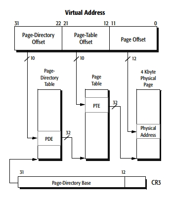

> O primeiro bloco de memória virtual é sempre inválido (entre 0 e 4095) dá sempre erro. para que os *null pointers* dêem excepção

Foram introduzidos também bits de controlo e proteção no **Page Table Index**, dos quais nos interessa saber:

- bit 0 **P** - Present - indica se este endereço de memória está a ser usado para apontar memória física real ou tem apenas *garbage* 
- bit 1 **R/W** - indica se o espaço apontado está protegido contra escrita
- bit 2 **U/S** - indica se o espaço apontado pertence ao *user mode* ou ao *kernel mode*

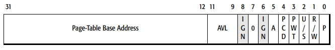

Com esta configuração e com o passar dos anos atingiu-se o limite de memória física possível de utilizar (4GB máximo), o que levou então à necessidade de aumentar o tamanho máximo da memória bem como a forma de endereçamento.

Surgiu então em 1995, com os processadores **Pentium Pro**, a técnologia **PAE (Physical Address Extension)** que permitia aos processadores de 32 bits acederem a mais de 4GB de memória física, uma necessidade já sentida especialmente pelos servidores de bases de dados que necessitavam de grandes quantidades de memória, uma vez que para serem mais rápidos, carregavam as DBs do disco (lento) para a memória (rápida).

Relativamente ao forma de tradução dos endereços virtuais para físicos, surgiu mais uma etapa entre o **CR3** e o **PDI**, o **PDPI (Page Directory-Pointer Index)**

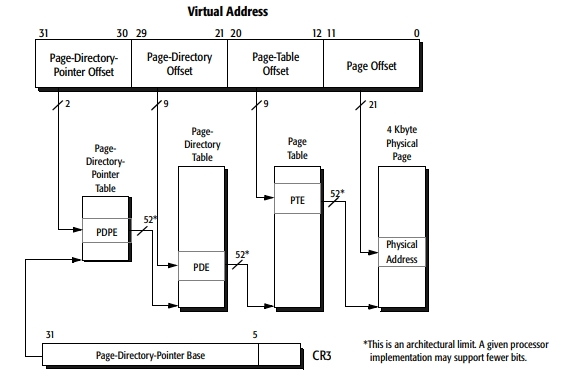

Em termos de proteção, surgio mais um bit de instrução, **NX - Non Execute**, o qual indica que não se pode fazer *fetch* desta parte da memória. temos também uma parte **reserved, MBZ (most be zeros)**, reservadas para futuras evoluções da arquitectura

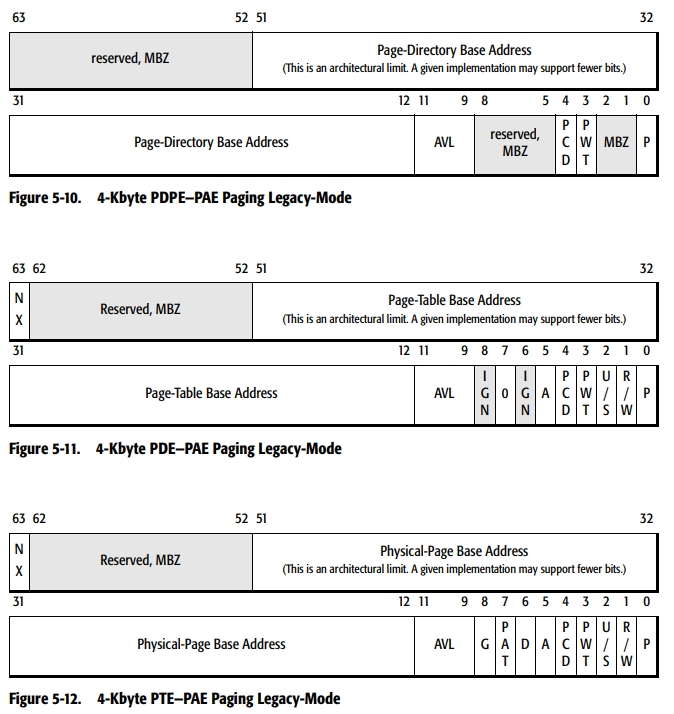

Por fim, no início dos anos 2000, apareceram os processadores a 64 bits. A *Intel* lançou o **Itanium** em 2001, destinado principalmente a servidores e a *AMD*, em 2003, começou a lançar processadores para computadores pessoais com os modelos **Opteron** e **Athlon 64**.

O sistema de tradução de endereços virtuais em endereços físicos, teve de ser alterado novamente, com a introdução de uma nova etapa entre o **CR3** e o **PDPI**, o **PML4 (Page-Map Level 4)** (sem ideias para novos nomes) 

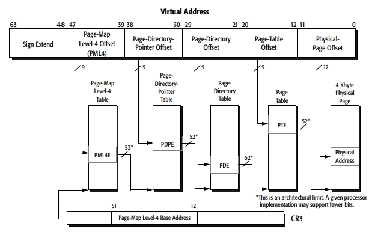

Com isto ficamos com um endereçamento possível de 16EB. No entanto o que acontece com o **Sign Extend** dos bits 63..48, e de forma a introduzir outra camada de proteção:

- **bits a 1** - Endereçamento reservado ao uso em *kernel mode*, 128TB
- **bits a 0** - Endereçamento para uso em *user mode*, 128TB

Existe assim um espaço enorme de endereçamento que ficou reservado para futuras evoluções. Temos 16EB de endereçamento possível, 1EB = 1024PB = 1048576TB, logo 16EB = 16777216TB. Com esta forma de endereçamento estamos a usar 128TB (kernel mode) + 128TB (user mode) = 256TB. Ficam assim reservados para futuras evoluções 16777216TB - 256TB = **16776960TB**

Em 2019, a *Intel* com os processadores **Ice Lake**, introduziu a possibilidade de usar paginação a 5 níveis, activando o bit **LA57** do registo **CR4**.

A paginação de 5 níveis expande o espaço de endereçamento virtual de 48 bits para 57 bits, permitindo o sistema operativo aceder até 128 PB (petabytes) de memória virtual. **PML5 (Page Map Level 5)** refere-se ao quinto nível adicionado à tabela de páginas. Tradicionalmente, a paginação de 4 níveis (PML4) permitia endereçar até 256 TB de memória virtual. Com a adição do quinto nível, o PML5 aumenta significativamente essa capacidade.

É necessario agora fazer 5 (em PML4) ou 6 (em PML 5) acessos à memória para ir ler ou escrever na mesma. Para resolver este problema, usamos o princípio da localidade:

- Temporal - é possível que venhamos a necessitar do mesmo bloco de memória num futuro próximo
- Espacial - se o programa está a correr neste bloco de memória, é provável que venhamos a necessitar dos blocos adjacentes

Com isto, foi criado o **TBL - Translation Lockchain Buffer**, uma espécie de cache de tradução de endereços.

Para mais informações, consultar o manual do AMD 64-bit Technology - Volume 2: System Programming [Manual 2 AMD64](https://kib.kiev.ua/x86docs/AMD/AMD64/24593_APM_v2-r3.06.pdf)
 
## 15OUT2024

### É sempre um executável (nativo)

- O software que fazemos e que é executado é **sempre executado por executáveis nativos**
- Para ver o que se passa em termos de recursos, é necessário descobrir qual é o executável nativo que está a correr
- Isto é verdade mesmo para executáveis como kotlin ou java a correr na jvm, o shell a intrepertar um script, node a intrepretar javascript, o próprio browser, etc.

### Contrução do espaço de endereçamento virtual

- O espaço de endereçamento virtual de um processo é construido a partir do executável que deu origem ao processo
- ... e das bibliotecas de que depende

#### Secções comuns num executável

- **HEADER** - contém informações essenciais para que o sistema operativo posssa carregar e executar o programa:
    * *Magic Number* - tipo de ficheiro
    * Tamanho do Header
    * *Entry Point* - local onde deve começar a primeira instrução do programa
    * Tabela de Secções - informações sobre as diferentes secções do ficheiro, como ```.text```, ```.data```, etc
    * Informações de *Debug* 
    * Em sistemas Unix-like, como Linux, BSD, etc. é utilizado o formato **ELF** (Excutable and Linkable Format) que inclui no header informações sobre o sistema operativo para o qual foi compilado, a arquitectura específica do processador (x86, ARM, etc), classe do ficheiro (32 ou 64 bits) e a versão do ELF.
    * Para ver o HEADER em linux: ```readelf -h nome_do_ficheiro```
- **.text** - sequência de intruções do programa
- **.rodata** - *Read-Only Data* - zona de constantes e literais de *string* (ex: ``` printf("%d\n", YEAR);```) do programa
- **.data** - variáveis do programa
- **.bss** - variáveis não inicializadas. No ficheiro executável apenas diz o tamanho que depois terá esta seccção em memória, uma vez que vai ser preenchida toda a zeros 


Na tradução de endereços cada secção tem especificidades diferentes de proteção, nos bits correspondentes ao **P**, **R/W** e **NX**:

|       | .text | .rodata | .data |
| ----- | ----- | ------- | ----- |
|**NX** | 0 | 1 | 1 |
|**R/W**| 0 | 0 | 1 |
| **P** | 1 | 1 | 1 |

Historicamente estas secções e a sua separação têm uma razão para existir, as quais podemos ver também nos sistemas embebidos simples actuais.

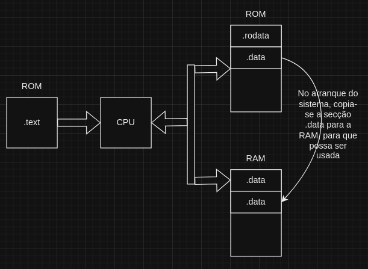

Atualmente, o mapeamento virtual não é mapeado sempre nos mesmos endereços, embora, a distância entre secções seja a mesma. Ex.: a intrução ```v(%rip)``` calcula o endereço de ```v``` a partir do ```rip```.

Um programa quando é compilado pode trazer também bibliotecas importadas. Quando este programa é carregado em memória, estas bibliotecas são igualmente carregadas.

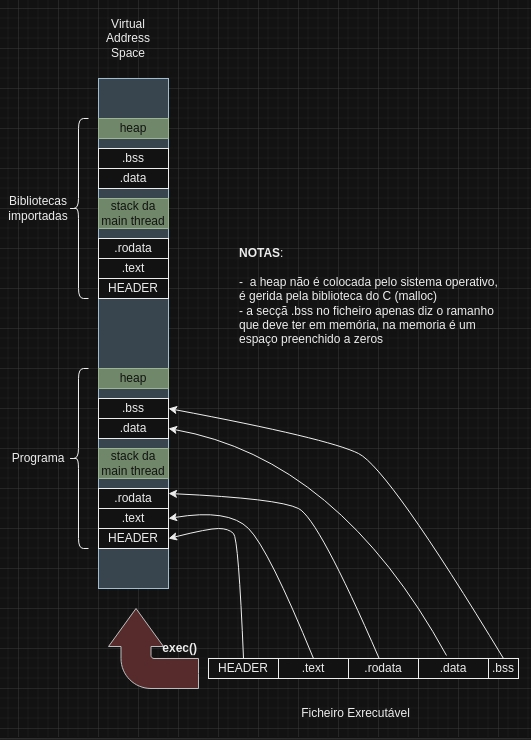

Um tipo de programa especial que é importado, são as chamadas **Bibliotecas de Ligação Dinâmica**, com a particularidade de não conterem no seu HEADER qual a primeira instrução a executar (*Entry Point*) do .text.

- Dinamic Link Librarie (.dll) - em Windows
- Shared Object (.so) - em Linux

#### Timeline do comando ```exec```

1. mapear executável no *Virtual Address Space*
2. mapear bibliotecas necessárias no *Virtual Address Space*
3. criar a *main thread*
    3.1. saltar para o *Entry Point* no ```.text```

### Alterações ao espaço de endereçamento virtual durante a execução do programa

 O sistema operativo pode alterar o espaço de endereçamento virtual durante a execução de um programa nas seguintes situações:
 
- Alocação de memória
    * quando a instrução ```malloc``` esgota a memória toda e é necessária mais, o sistema operativo aloca mais um *chunk* em múltiplos de 4KB
    * o ```malloc``` faz a gestão 'fina' desses blocos 
- Criação de *threads* - envolve criar mais *stacks*	 
- Carregamento de ```dll/so``` a meio da execução
    * ```dlopen``` - instrução que recebe ```.so``` como argumento
- Mapeamento de ficheiros em memória
    * ```mmap```
- as operações inversas destas 4 operações

> Os nossos executáveis em java/kotlin carregam o ```.so``` da *JVM* (```libjvm.so```)

## 16OUT2024

### 3 Pilares da estratégia de minimização da ocupação da memória física por parte do Kernel

**Primeiro Pilar - PAGE FAULT**

Inicialmente, não se mapeam os endereços virtuais para a memória física

- o primeiro acesso de cada página resulta numa excepção, **PAGE FAULT**
- o kernel reage alocando memória, preenchendo-a com os devidos dados e retornando para <u>repetir</u> a instrução falhada
- a esta técnica chama-se **DEMAND PAGING**

**Segundo Pilar - Partilha de recursos**

Se vários procecssos precisam do mesmo bloco de dados, o kernel, favorece a <u>partilha</u> do respetivo bloco da memória física.

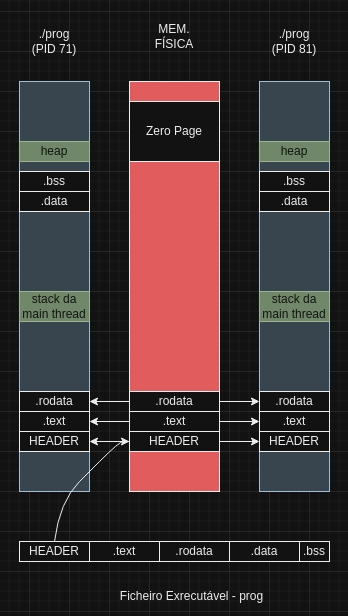

- Quando existe um PAGE FAULT o kernel carrega os dados na memória fisica e mapei-as no para o(s espaço(s) de memória virtuai(s))
- As seções sem dados, ```stack```, ```heap``` e ```.bss``` são mapeadas para a **Zero Page** com **COW** (Copy-On-Write).
- Quanto à secção ```.data```, é mapeada entre os processos, metendo-se o bit **R/W** a zero. Quando um dos processos tenta escrever, acontece novamente a excepção e o kernel copia os dados para outro local colocando o bit **R/W** a um. Também é usada a técnica **COW**.
- Em zonas de memória que permitem a escrita também é possível a partilha, com os mapeamentos *read only* e cópia seguida de correção nos PAGE FAULT.

**Terceiro Pilar - DEBUG PAGING**

Manter o Resident-Set aproximado do Working-Set através de DEBUG PAGING

Definições:

- **Resident-Set** - conjunto de páginas físicas referidas pelo espaço de endereçamento de um processo. RSS - Resident Size Set. Em Windows é chamado de Working-Set!!!
- **Working-Set** - conjunto de páginas físicas <u>usadas</u> por um processo num <u>intervalo de tempo</u>. Em pricípio, é menor que o Resident-Set.
- **DEBUG PAGING** - o processo usado pelo kernel para gerir a memória. Blocos de memória (páginas) são movidos (swap) entre a memória física (RAM) e a memória secundária (disco rígido ou SSD).

> **Como ver a quantidade de memória usada por um programa?**
>
> - na virtual - calcular / contar a totalidade dos endereços mapeados
>
> - na física - monitorizar o RSS, normalmente, bem menor que os endereços virtuais. No entanto, se existirem vários processos numa solução desenvolvida por nós, não basta apenas somar os RSS devido ao espaço partilhado entre processos.
> 
> Em windows - é nos mostrado quanto do RSS está a ser partilhado com outros processos
>
> Em Linux - existe o **PSS** - Proportional-Set-Size:
> 	- páginas físicas do processo contam 1 vez
> 	- páginas físicas partilhadas por n processos, contam 1/n vezes
>
> **Métrica real deve ficar entre RSS e PSS**


**Swap File / Swap Partition**

Para salvaguardar o conteúdo de uma página que já não está a ser usada e cujos dados já foram alterados, é guardada no **swamp file** ou **swap partition**, em blocos de 4KB. - **SWAP OUT**

No Windows a *swap file* tem o nome ```pagefile.sys```

Se os dados transfereidos para a **swap** forem necessários novamente, dá-se um PAGE FAULT e o kernel transfere-os novamente para a memória física - **SWAP IN**

### BACKING STORAGE

As páginas do espaço de endereçamento virtual têm sempre alguma zona em disco que suporta o armazenamento de dados enquanto não estão na memória física - designa-se esta zona por **BACKING STORAGE**

Para cada página do endereçamento virtual há uma zona de *Backing Storage** que pode ser:

- o ficheiro executável
- a(s) bibliotecs(s) usadas
- swaping space

#### Zonas de Backing de Storage

- Para as regiões ```HEADER```, ```.text```, ```.rodata```, a zona de *backing storage* é o respetivo executável ou biblioteca.
- Para as regiões ```.bss```, ```stack``` ou ```heap```, a zona de *backing storage* é o *swap space* - também chamado de memória virtual
- Para a região ```.data```, começa com o *backing storage* no executável e assim que seja modificado (**COW**) o seu *backing storage* passa a ser no *swap space*

## 22OUT2024

### Informação sobre processos a correr

Quando o `kernel` arranca, faz a inicialização e testes ao *hardware* e depois chama o `init`. Este vai correr ficheiros de configuração do sistema e arrancar serviços, no fundo preparar o que se chama de **Ambiente de operação**. Uma particularidade do sistema linux é que este `init` pode ser "encaminhado" para outro programa. Em *Ubuntu*, `sbin/init` é um *dynamic link* (atalho em windows) para `../lib/systemd/systemd`. Para mais info [systemd.io](https://systemd.io/).

Entre outros, um dos programas para ver informações sobre os processos que correm no sistema operativo é o ```ps```.

Ao executar na shell o comando ```ps aux``` ou ```ps -A ux```, este vai-nos listar todos os processos a correr em `user mode`, com os separadores:

- **USER** - dono do processo
- **PID** - *Process Id*
- **%CPU** - percentagem de CPU usado
- **%MEM** - percentagem de memória física usada
- **VSZ** - *Virtual Memory Size*, quantidade total de espaço de endereçamento virtual que o processo está a utilizar, inclui todas as bibliotecas, ficheiros mapeados e memória alocada, mesmo que partes desta memória não esteja atualmente carregada na memória física
- **RSS** - *Resident Set Size*, quantidade de memória física que o processo está a utilizar atualmente
- **STAT** - estado do processo
    * **R** - running
    * **S** - sleeping
    * **D** - uninterruptible sleep - o processo está em espera mas não pode ser interrompido (geralmente à escuta de I/O)
    * **T** - stopped
    * **Z** - zombie - terminou mas ainda tem uma entrada na tabela de processos
    * **I** - idle
    * **<** - high-priority
    * **N** - low-priority
    * **L** - has Locked pages - tem páginas bloqueads na memória
    * **s** - session leader
    * **l** - multi-threaded
    * **+** - in the foreground process group
- **START** - data de inicio
- **TIME** - tempo total de CPU que o processo utilizou
- **COMMAND** - comando que deu origem ao processo

### File Hierarchy Standard - FHS

O **Filesystem Hierarchy Standard** (padrão para sistema de arquivos hierárquico), define as principais diretorias, e o seu conteúdo, num sistema operativo Linux ou do tipo Unix. 

| Directoria | Descrição |
| ---------- | --------- |
| **/** | raiz da hierarquia |
| **/bin** | programas, binários executáveis (ex.: cat, ls, cp, etc) |
| **/boot** | ficheiros do *boot loader* (ex: kernel, initrd) |
| **/dev** | dispositivos (I/O) |
| **/etc** | ficheiros de configuração específicos do computador |
| **/home** | ficheiros do utilizador |
| **/lib** | bibliotecas |
| **/mnt** | sistemas de ficheiros montados temporariamente |
| **/media** | pontos de montagem para média removível (ex: USB-drive) |
| **/opt** | pacotes estáticos das aplicações |
| **/proc** | **Sistemas de ficheiros virtual, que possui o estado do kernel e processos do sistema; a maioria dos ficheiros é baseada no formato texto (ex: tempo de execução, rede).** |
| **/root** | ficheiros do *super user* - **root** |
| **/sbin** | programas administrativos do sistema |
| **/tmp** | ficheiros temporários |
| **/srv** | dados específicos que são servidos pelo sistema. |
| **/sys** | **informações sobre dispositivos, *drivers* e algumas funcionalidades do kernel** |
| **/usr** | Hierarquia secundária para dados partilhados entre *users*, cujo acesso é restrito apenas para leitura. |
| **/var** | ficheiros de variáveis, como logs, bases de dados, páginas web e arquivos de email |

Tanto `/proc` como `/sys` são especiais na medida em que são directorias do tipo `proc` e `sysfs`.

**/proc** apresenta informações do kernel e tem informações sobre os processos que estão a correr

- cpuinfo - informações sobre o CPU
- kcore - representa a memória do kernel
- [pid]/maps - espaço de endereçamento
- [pid]/smaps - informaçoes sobre a utilização do espaço de endereçamento

### /proc/[pid]/maps

Mostra uma tabela com o endereçamento virtual dividido por seções (HEADER, .data, .text, .rodata, etc). Cada região, mostra:

-  endereços de começo e termino
-  permissões
	- r - read
	- w -write
	- x - execute
	- p - private 
- offset
- dispositivo onde a memória foi mapeada
- inode - número do inode do ficheiro mapeado
- nome do ficheiro 

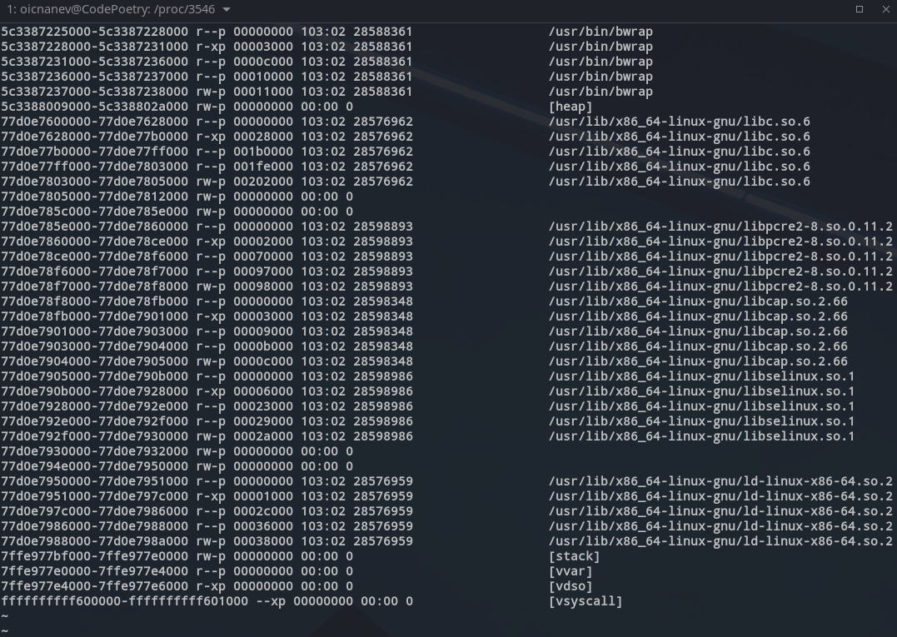

Aqui vemos, por exemplo:

- HEADER - `5c3387225000-5c3387228000 r--p 00000000` - é apenas de leitura, começa no offset 0 e ocupa apenas 0x3000, 12KB
- .text - `5c3387228000-5c3387231000 r-xp 00003000` - é em endereço seguido ao HEADER, é executável, e ocupa 0x9000, 26KB
- .rodata - `5c3387231000-5c3387236000 r--p 0000c000` - é em endereço seguido ao .text, só de leitura e ocupa 0x5000, 20KB
- ??? - `5c3387236000-5c3387237000 r--p 00010000` - outra secção seguida só de leitura mas mais pequena, ocupa 0x1000, 4KB
- .data - `5c3387237000-5c3387238000 rw-p 00011000` - em endereço seguido, permite leitura e escrita e ocupa 0x1000, 4KB
- heap - `5c3388009000-5c338802a000 rw-p 00000000`
- depois vêm bibliotecas com a mesma estrutura
- stack da main thread
- vvar - variáveis read-only, normalmente coisas que só o kernel pode escrever e disponibiliza uma versão read-only para os processos
- vdso - "Virtual Dynamic Shared Object" - expõe algumas funcionalidades do kernel diretamente para a aplicação
- vsyscall - similar ao vdso mas técnica mais antiga

### /proc/[pid]/smaps

Com `less /proc/[pid]/smaps`, obtém-se informações detalhadas sobre o consumo de memória de cada mapeamento do processo. Este ficheiro é mais detalhado que `/proc/[pid]/maps` e inclui várias métricas úteis para análise de desempenho e depuração. 

1. **Size**: O tamanho total do mapeamento.
2. **Rss (Resident Set Size)**: A quantidade de memória que está atualmente residente na memória física.
3. **Pss (Proportional Set Size)**: A parte proporcional da memória compartilhada com outros processos, que é atribuída ao processo.
4. **Shared_Clean**: Páginas compartilhadas que não foram modificadas.
5. **Shared_Dirty**: Páginas compartilhadas que já foram modificadas (escritas).
6. **Private_Clean**: Páginas privadas que não foram modificadas.
7. **Private_Dirty**: Páginas privadas que já foram escritas.
8. **Referenced**: A quantidade de memória que foi referenciada recentemente.
9. **Anonymous**: Memória que não pertence a nenhum ficheiro.
10. **Swap**: Quantidade de memória que foi trocada para o disco.
11. **KernelPageSize**: O tamanho da página usado pelo kernel para suportar a área de memória virtual.
12. **MMUPageSize**: O tamanho da página usado pela Unidade de Gerenciamento de Memória (MMU).
13. **Locked**: Indica se o mapeamento está bloqueado na memória.
14. **ProtectionKey**: A chave de proteção de memória associada à área de memória virtual.
15. **VmFlags**: Flags do kernel associadas à área de memória virtual, como legível (rd), gravável (wr), executável (ex), etc.

> A soma de `Shared_Clean`, `Shared_Dirty`, `Private_Clean` e `Private_Dirty` tem de dar o valor de `Rss`

![exemplo de /proc/[pid]/smaps](../img/proc_smaps.png)

## 29OUT2024

### Mapeamento de ficheiros em memória com `mmap` e `munmap`

- `void *mmap(void *addr, size_t lenght, int prot, int flags, int fd, off_t off);`
    * *addr -  endereço desejado ou então NULL para o OS escolher
    * length - tamanho do espaço
    * prot - r/w/x
    * flags - *private* ou *shared*
    * fd - ficheiro a mapear
    * off - offset
    * **embora seja `void` retorna o endereço em que o ficheiro ficou mapeado**

- `int munmap(void *addr, size_t length);`
    * efetua a operação contrária ao `mmap`, ou seja, remove um mapeamento de página em memória

#### Mapeamento privado versus partilhado

- **flag MAP_PRIVATE** 
	- o mapeamento pertece apenas ao processo
	- escritas são apenas visíveis para o processo e não se propagam para o ficheiro
- **flag MAP_SHARED**
	- pode ser partilhada através de `fork()`
	- é visivel a todos os processos que estiverem a partilhar este ficheiro
	- a escrita por um processo torna-se visível a todos os outros processo
- **flag MAP_FIXED**
    * serve para alocar memória sem mapear nenhum ficheiro

#### Usos comuns

O `mmap` é muitas vezes usado após um `lseek` para mapear diretamente ficheiros em memória sem fazer a operação `read`.

Desta forma é possível mapear ficheiros grandes na memória virtual sem que os mesmos vão parar à memória física.

É uma forma de definir regiões em memória como *backing storage*

Muitos usado em motores de bases de dados e até mesmo na JVM

> `lseek(fd, 0, SEEK_END);` - levar o cursor até 0 bytes do final do ficheiro *fd*

### Page Eviction

- **Working Set** - conjunto de páginas acedidas por um programa durante um intervalo de tempo
- **Resident Set** - quantidade de blocos de memória virtual mapeada na memória física num determinado ponto do tempo

O sistema operativo, procura equilibrar o *Resident Set* com o *Working Set*. Se o *Working Set* reduzir, o *Resident Set* deve também reduzir. O sistema operativo faz isto de uma forma não muito agressiva, uma vez que uma página que não está a ser usada 'agora' pode num futuro próximo vir a ser 'usada'.

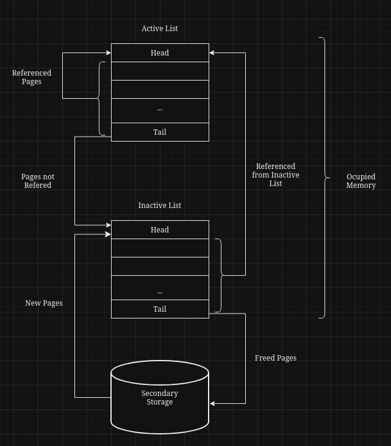

O sistema operativo corre o algoritmo de *Page Eviction* se:

- a memória física livre estiver baixa
- existir desiquilibrio entre as listas *Active List* (muito grande) e *Inactive List* (muito pequena)
- São usados neste algoritmo os bits **A** (Accessed), **D** (Dirty) e **R** (Referenced) dos PTE, PDE, PDPE - posicionados pela MMU do CPU

#### Pouca memória livre

- o algoritmo procura agressivamente libertar memória da *Inactive List*
- Se não for suficiente, procura menos agressivamente, libertar memória na *Active List*
- Se o bit **A** == 0 e **R** == 0, é para libertar
- Se o bit **A** == 1, e **R** == 0, mete-se **R** = 1 e **A** = 0
- Se o bits **A** e **R**, passa para a *Active List*, colocando o **R** = 0
- Se o bit **A** == 0 e **R** == 1, então **R** = 0

#### Desequilibrio entre *Active List* e *Inactive List*

- Se **A** e **R** == 0, vai para a *Inactive List*

#### Resumo

- É preciso ver duas vezes **R==0** para libertar a página
- É preciso ver duas vezes **R==1** para a promover para a *Active List*

 
