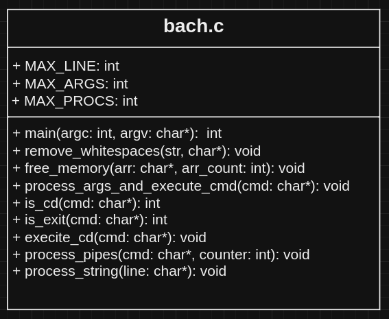

## ISEL - System Virtualization Techniques
### Coursework Assignment 1

#### 1. Implementation of bach - **B**ash **A**lternative from **Ch**elas

Our shell, *bach* was developed with three key points in mind:

- **Command Parsing**: The program reads a command from the user, splits it into arguments, and handles special commands like ```cd``` and ```exit```.
- **Pipe Handling**: It supports commands connected by pipes (|), creating the necessary pipes and forking processes to execute each command in the pipeline.
- **Redirection**: The program can redirect output to a file if the command includes ```>```.
- **Memory Management**: It allocates and frees memory for command arguments and handles errors gracefully.



In our implementation we define 3 macros (```#define```):

- MAX_LINE 131072 - For the maximum input line of the user. In Linux systems, the maximum size of a command is 128KB = 131072 Bytes.
- MAX_ARGS 100 - For the maximum number of arguments of a command, not sure if there is any limit other than the size of the line.
- MAX_PROCS 10 - For the maximum number of commands passed. Like ARGS, I think there's no limit other than the size of the line.

We divided our program in 9 functions:

- ```int main(int argc, char *argv[])``` - main loop that grabs user input though ```fgets```.
- ```void process_string(char *line)``` - to create an array of commands (separated by pipes)
- ```void process_pipes(char *cmd[], int counter)``` - to create and configure (dup2) the necessary pipes for each command in the commands array
- ```void process_args_and_execute_cmd(char *cmd)``` - to execute individual commands with or without arguments. Also implements the command ```cd``` and ```exit```.
- ```execute_cd(cmd: char*)``` - to execute ```cd``` (change directory) without making any ```fork()``` because we need change directory in the  process of **bach**.
- ```is_cd(cmd: char*)``` - like a boolean to check if the command that the user wrote is ```cd```
-  ```ìs_exit(cmd: char*)``` - like a boolean to check if the command that user wrote is ```exit```
- ```remove_whitespaces(str: char*)``` - to remove ```space``` between *pipes* and *command arguments*, also removes aditional ones introduced by the user.
- ```free_memory(arr: char*, arr_count: int)``` - to execute the *C* ```free```command in arrays that are no more used.

#### main

Responsible for reading user input and forwarding it to the next function for processing. The function runs an infinite loop, allowing the user to enter multiple commands until an EOF (End of File) is encontered. This input is readed from the standard input though the function ```fgets```. After geting the input, it is passed to the function ```process_string()```.

#### process_string

Receives a string that is the user inputted commands. Creates an empty array of commands of size ```MAX_PROCS``` and ```command_counter```. Then separates the commands by pipes (|), removes accidental white spaces surrounding the command and add the null character to each one, incrementing the command_counter. After parsing all the user inputted line, call the next function ```process_pipes``` passing the array of commands and the command_counter as arguments. 

Before starting to separate every command in the user inputted string is necessary to remove the new line character if present, we used [strcspn](https://documentation.help/C-Cpp-Reference/strspn.html) to find the `\n` index and substituted its value by 0.

For separating the user inputted line by pipes (|) we used the function [strtok](https://documentation.help/C-Cpp-Reference/strtok.html#:~:text=strtok.%20Syntax:%20#include%20%3Ccstring%3E%20char%20*strtok(%20char%20*str1,))

To remove accidental white spaces surrounding the command we call the function ```remove_whitespaces```

To allocate the new string (only the command with arguments) to the new array, we used the function [strdup](https://en.cppreference.com/w/c/experimental/dynamic/strdup#:~:text=char%20*%20strdup%20(const%20char%20*%20str1%20);%20(dynamic%20memory)) that returns a pointer to the function.

In the end, it's necessary to free the memory allocated by the strdup, and we used the function ```free_memory```.


#### process_pipes

Based on the number of commands, it creates the necessary number of pipes and puts them in an array of pipes. Number of pipes = 2 x (number of commands - 1) - First command only needs out_pipe and the last one, in_pipe.

Then, checks if the command is ```cd``` or ```exit``` and if true executes them. Using ```is_cd```, ```is_exit``` and ```execute_cd```.

If not ```cd``` or ```exit```, it forks each command in the command array creating child processes and passes them to the function ```process_args_and_execute_cmd``` for execution

In the end, closes all the pipes in the parent process, waits for all the child processes to finish and closes all pipes from the child.

#### process_args_and_execute_cmd

In the same fashion as the ```process_string``` function removes accidental spaces and separates all argument keeping them in an array of arguments.

Checks if there are redirection to a file and duplicates the process with ```execvp```

In the end frees all memory allocated by the array of arguments. 

#### remove_whitespaces
We used the [isspace](https://documentation.help/C-Cpp-Reference/isspace.html) function to locate the spaces and remove it.

#### free_memory
We transverse an array and for each element we call the *C* function ```free```

#### is_cd and is_exit
Return 1 if ```cd``` \ ```exit``` is on the command

#### execute_cd
Checks if there are arguments (*path*) in the command and if true executes the *C* function ```chdir```. If there are no arguments or does't find the *path* it notifies the user accordingly.

#### 2. Add a new user to a Linux system

In the terminal do:
```terminal
$ useradd iselx -m -s [full path to the new shell]
$ passwd iselx
Enter new UNIX password:
Retype new UNIX password:
```

After this logout and login with the new user *iselx*

#### 3. POSIX **tee** command

- [tee documentation](https://pubs.opengroup.org/onlinepubs/9699919799/utilities/tee.html)
- **Purpose**: the ```tee``` utility copies standard input to standard output and also to one or more files. It is often used in pipelines to save intermediate data.
- **Use Cases**:
    * **Loggging**: Capture the output of a command while still displaying in on the terminal.
    * **Debugging**: Save the output of pipeline step for later inspection without interrupting the pipeline flow.
    * **Data Processing**: Store intermmediate results in a file for further analusis or processing.
- **Examples**:
    * **Basic Usage**: ```command | tee file.txt``` - this command runs ```comand```, displays its output, and saves it to ```file.txt```.
    * **Appending to a File**: ```command | tee -a file.txt``` - this appends the output of ```command``` to ```file.txt``` instead of overwriting it. Usual scenario, a log file
    * **Saving Intermediate Output**: ```sort grocery-supply.txt | tee sorted-grocery.txt | head -1``` - sorts the contents of ```grocery-supply.txt```, saves the sorted list in ```sorted-grocery.txt``` while displaying the first item of the sorted list. 
    * **Ignoring Interrupts**: ```some_command | tee -i output.log``` -  this command runs ```some_command```, logs the output to ```output.log```, and ignores interrupt *signals* (like Ctrl+C).
    * **Logging and Processing**: ```df -h | tee disk-usage.log | grep '/dev/sda1'``` - this command displays the disk usage, logs it to ```disk-usage.log```, and the filters the output to show only the line containing ```/dev/sda1```.
    * **Multiple Outputs**: ```echo "Hello, PSC!" | tee file1.txt file2.txt file3.txt``` - this command writes "Hello, PSC!" to ```file1.txt```, ```file2.txt```, and ```file3.txt```.
    * **Combining with Other Commands**: ```ps aux | tee processes.log | grep 'root' | tee root-processes.log | wc -l``` - this command lists all running processes, logs them to ```processes.log```, filters for processes owned by ```root```, logs those to ```root-processes.log```, and then counts the number of root processes.
