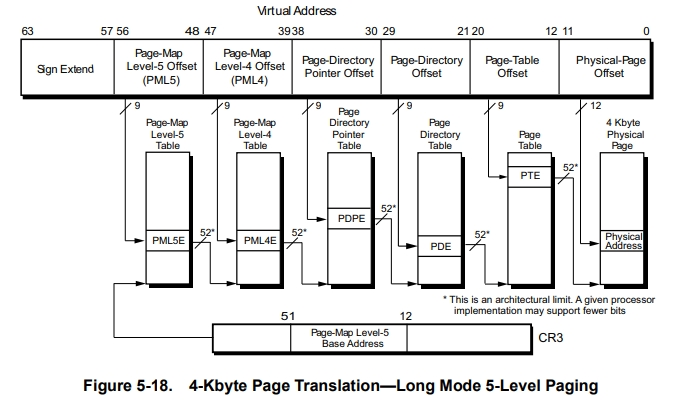
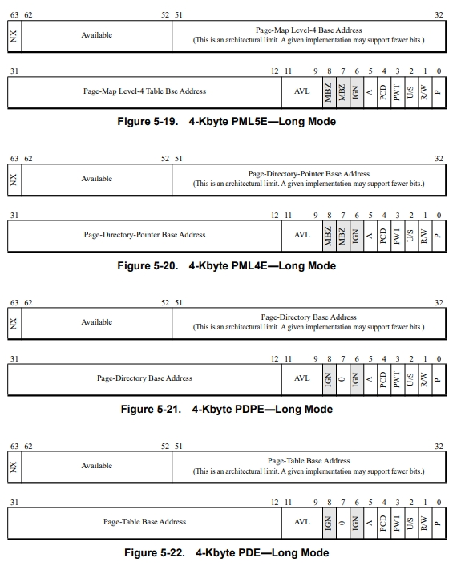
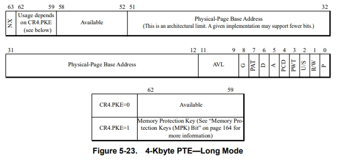

### Exercise 1

**a) Consider Figures 5-18 through 5-23. What changes would need to be made to these figures if the architectural limit for physical memory were to be increased to 64 PB?**

----

<!-- Write your answer here, along with the reasoning behind it. -->

#### Respostas do *chat* com *Microsoft copilot*

To address the changes needed for Figures 5-18 through 5-23 if the architectural limit for physical memory were increased to 64 PB, we need to consider several key aspects of memory management and architecture:

1. **Address Space Expansion**: The figures would need to reflect the expanded address space. For a 64 PB limit, the address space would need to be significantly larger, likely requiring a 64-bit address space if not already in use.

2. **Page Table Entries**: The size and structure of page table entries might need to be adjusted to accommodate the larger physical memory. This could involve increasing the number of bits used for physical addresses in the page table entries.

3. **Segmentation and Paging**: The segmentation and paging mechanisms would need to be updated to handle the larger address space. This might involve changes to the segmentation descriptors and the paging structures to ensure they can address the full 64 PB.

4. **Memory Management Units (MMUs)**: The MMUs would need to be capable of handling the larger address space. This could involve updates to the hardware to support the increased number of address bits.

5. **System Software**: Operating systems and other system software would need to be updated to manage the larger physical memory. This includes changes to memory allocation algorithms, virtual memory management, and possibly the kernel itself.

6. **Hardware Support**: The underlying hardware, including CPUs and memory controllers, would need to support the larger address space. This might involve updates to the hardware design to ensure compatibility with the new memory limits.

These changes would ensure that the system can effectively utilize the increased physical memory limit of 64 PB. If you have specific figures or details from the document, I can provide more targeted suggestions.

Source: Conversation with Copilot, 10/15/2024
(1) CHAPTER 3 PROTECTED-MODE MEMORY MANAGEMENT - Donald Bren School of .... https://ics.uci.edu/~aburtsev/cs5460/lectures/midterm-pdfs/intel-segmentation-and-paging.pdf.
(2) Lecture 12: Memory Management - Department of Computer Science. https://www.cs.cornell.edu/courses/cs4410/2021fa/assets/material/lecture12_memory_management_1.pdf.
(3) Lecture 13: Memory Management Swap and Paging - Department of Computer .... https://www.cs.cornell.edu/courses/cs4410/2021fa/assets/material/lecture13_memory_management_2_lightweight.pdf.
 
