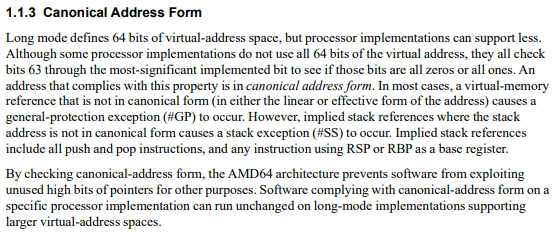
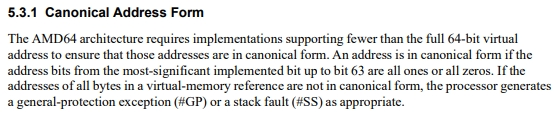

### Exercise 1

**b) Suppose AMD wants to support virtual address spaces of 512 PB. What changes would need to be made to Figure 5.18? How many different "Page-Map Level-5" tables could then exist for a single process? Read sections 1.1.3 and 5.3.1 and indicate the ranges of canonical addresses for the proposed extension.
**

----

----

Há pelo menos 3 formas distintas de obter *virtual address spaces* de 521PB:

- 12 (offset) + 10 (PTI) + 10 (PDI) + 10 (PDP) + 10 (PML4) + 10 (PML5) = 62 bits
  - 2^62^ = 4EB de endereçamento
- 10 (offset) + 10 (PTI) + 10 (PDI) + 10 (PDP) + 10 (PML4) + 10 (PML5) = 60 bits
  - 2^60^ = 1EB
  - a memória física teria de ser dividida em blocos de 2^10^ = 1KB
- 14 (offset) + 10 (PTI) + 10 (PDI) + 10 (PDP) + 10 (PML4) + 10 (PML5) = 59 bits
  - 2^59^ = 512Page_table
  - a memória física teria de ser dividida em blocos de 2^14^ = 16KB

Quanto ao número de *"Page-Map Level-5"*, em qualquer das soluções seria apenas 1.

Relativamente à *"Canonical Address Form"*:

- com os 62 bits para endereçamento ficavamos apenas com o bit 63 livre para extender o sinal
  - bit a 1 - endereços para *kernel mode*
    - do 0xC000 0000 0000 0000 ao 0xFFFF FFFF FFFF FFFF
  - bit a 0 - endereços para *user mode*
    - do 0x0000 0000 0000 0000 ao 0x3FFF FFFF FFFF FFFF
- com os 60 bits para endereçamento ficamos com os bits 60..63 para extender sinal
  - bit a 1 - endereços para kernel mode
    - do 0xE000 0000 0000 0000 ao 0xFFFF FFFF FFFF FFFF
  - bit a 0 - endereços para user mode
    - do 0x0000 0000 0000 0000 ao 0x1FFF FFFF FFFF FFFF
- com os 59 bits para endereçamento ficavamos cos os bits 59..63 para extender o seinal
  - bit a 1 - endereços para kernel mode
    - do 0xF800 0000 0000 0000 ao 0xFFFF FFFF FFFF FFFF
  - bit a 0 - endereços para user mode
    - do 0x0000 0000 0000 0000 ao 0x07FF FFFF FFFF FFFF
