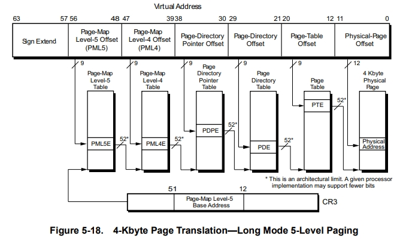

### Exercise 1

**b) Suppose AMD wants to support virtual address spaces of 512 PB. What changes would need to be made to Figure 5.18? How many different "Page-Map Level-5" tables could then exist for a single process? Read sections 1.1.3 and 5.3.1 and indicate the ranges of canonical addresses for the proposed extension.
**

----

**Changes to be made to Figure 5.18**

<!-- Write your answer here, along with the reasoning behind it. -->
To support virtual address spaces of 512 petabytes (PB), AMD would need to make several changes to the architecture and implementation of their virtual memory system. Here are some key considerations:

1. **Increase Address Width**: The current 48-bit virtual address space would need to be expanded. For 512 PB, a 59-bit address space is required, as \(2^{59} = 512 \text{ PB}\).

2. **Page Table Levels**: The page table structure would need to support additional levels. Currently, AMD uses a four-level page table for 48-bit addresses. To support 59-bit addresses, a five-level page table would be necessary.

3. **Hardware Support**: The CPU and memory management unit (MMU) would need to be updated to handle the increased address width and additional page table levels.

4. **Operating System Changes**: The operating system kernel, such as Linux, would need to be updated to support the new address space and page table structure. This includes changes to memory management routines and data structures.

5. **Software Ecosystem**: Applications and system software may need updates to handle the larger address space, especially if they make assumptions about address sizes.

These changes would be similar to those made in the x86_64 architecture when it introduced support for five-level page tables to handle larger address spaces³.

Would you like more details on any specific aspect of these changes?

Source: Conversation with Copilot, 10/15/2024
(1) Understanding 52-bit virtual address support in the Arm64 kernel. https://opensource.com/article/20/12/52-bit-arm64-kernel.
(2) Linux 5.18 Features Include Many AMD & Intel Additions ... - Phoronix. https://www.phoronix.com/review/linux-518-features.
(3) Linux 5.18 Preparing For Release - Especially Heavy With ... - Phoronix. https://www.phoronix.com/news/Linux-5.18-Nears-Release.

**Maximum number of "Page-Map Level-5" tables per process**

<!-- Write your answer here, along with the reasoning behind it. -->
In a system with a five-level page table hierarchy, the number of different "Page-Map Level-5" tables that could exist for a single process depends on the architecture and the amount of virtual address space allocated to the process. Each level in the hierarchy maps a portion of the virtual address space to the next level, ultimately mapping to physical memory.

Here's a simplified breakdown:

1. **Page-Map Level-5 (PML5)**: This is the top level and contains entries that point to Page-Map Level-4 (PML4) tables.
2. **Page-Map Level-4 (PML4)**: Each entry points to a Page-Directory-Pointer Table (PDPT).
3. **Page-Directory-Pointer Table (PDPT)**: Each entry points to a Page Directory (PD).
4. **Page Directory (PD)**: Each entry points to a Page Table (PT).
5. **Page Table (PT)**: Each entry points to a physical page in memory.

The number of PML5 tables is determined by the number of entries in the PML5 table and the size of the virtual address space. For example, in a 64-bit system with 4KB pages, each level typically has 512 entries (since \(2^9 = 512\)).

Therefore, the number of different PML5 tables for a single process is theoretically very large, as each entry in the PML5 table can point to a different PML4 table, and so on down the hierarchy. However, in practice, the number of PML5 tables is limited by the amount of virtual address space the process uses and the system's memory management policies¹².

If you have any specific details or constraints in mind, feel free to share them, and I can provide a more tailored explanation!

Source: Conversation with Copilot, 10/15/2024
(1) Page Tables — The Linux Kernel documentation. https://docs.kernel.org/mm/page_tables.html.
(2) Page tables (CS 4410, Summer 2015) - Department of Computer Science. https://www.cs.cornell.edu/courses/cs4410/2015su/lectures/lec14-pagetables.html.
(3) Page table - Wikipedia. https://en.wikipedia.org/wiki/Page_table.

**Ranges of canonical addresses**

<!-- Write your answer here, along with the reasoning behind it. -->
To determine the ranges of canonical addresses for the proposed extension to support virtual address spaces of 512 PB, we need to understand how canonical addresses are structured in the AMD64 architecture.

### Canonical Address Ranges

In the AMD64 architecture, canonical addresses are those that are properly sign-extended to 64 bits. For a 48-bit virtual address space, the canonical address ranges are:

- **Lower Half**: 0x0000000000000000 to 0x00007FFFFFFFFFFF
- **Upper Half**: 0xFFFF800000000000 to 0xFFFFFFFFFFFFFFFF

For a 57-bit virtual address space (which is closer to the 512 PB requirement), the canonical address ranges would be:

- **Lower Half**: 0x0000000000000000 to 0x00FFFFFFFFFFFFFF
- **Upper Half**: 0xFF00000000000000 to 0xFFFFFFFFFFFFFFFF

### Proposed Extension to 59-bit Address Space

To support a 512 PB virtual address space, we need a 59-bit address space. The canonical address ranges for a 59-bit address space would be:

- **Lower Half**: 0x0000000000000000 to 0x07FFFFFFFFFFFFFF
- **Upper Half**: 0xF800000000000000 to 0xFFFFFFFFFFFFFFFF

These ranges ensure that the addresses are properly sign-extended to 64 bits, maintaining compatibility with the existing architecture while extending the addressable space.

If you have any specific details or further questions, feel free to ask!

Source: Conversation with Copilot, 10/15/2024
(1) ISO NEW ENGLAND PLANNING PROCEDURE NO. 5-1. https://www.iso-ne.com/static-assets/documents/rules_proceds/isone_plan/pp05_1/pp5_1.pdf.
(2) RFC 7231: Hypertext Transfer Protocol (HTTP/1.1 ... - RFC Editor. https://www.rfc-editor.org/rfc/rfc7231.
(3) Wireshark User’s Guide. https://www.wireshark.org/docs/wsug_html/.
(4) undefined. http://www.rfc-editor.org/info/rfc7231.
(5) undefined. http://trustee.ietf.org/license-info%29.

