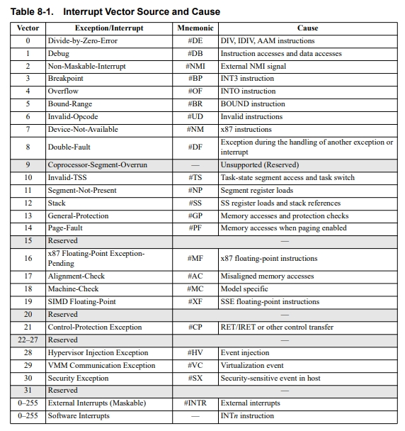

### Exercise 1

**C) While processing the Present (P) bit in Page-Translation-Table Entry Fields (see Section 5.4.1), one of the entries in Table 8-1 is particularly relevant. Which entry is that, and why?**

#### **5.4.1 Filed Definitons**

...

**Present (P) Bit**. Bit 0. This bit indicates whether the page-translation table or physical page is loaded in physical memory. When the P bit is cleared to 0, the table or physical page is not loaded in physical memory. When the P bit is set to 1, the table or physical page is loaded in physical memory. 

Software clears this bit to 0 to indicate a page table or physical page is not loaded in physical memory. A page-fault exception (#PF) occurs if an attempt is made to access a table or page when the P bit is 0. System software is responsible for loading the missing table or page into memory and setting the P bit to 1. 

When the P bit is 0, indicating a not-present page, all remaining bits in the page data-structure entry are available to software. 

Entries with P cleared to 0 are never cached in TLB nor will the processor set the Accessed or Dirty bit for the table entry.

...

----

<!-- Write your answer here. -->

**Exception/Interrupt When P Bit is 0**
When the Present (P) bit is set to 0 and an attempt is made to access the page, the processor triggers a page fault exception. This is a type of interrupt that signals the operating system to handle the situation. The page fault exception allows the operating system to bring the required page into physical memory from disk or another storage medium.

**Why the Exception Occurs**
The page fault exception occurs because the processor cannot proceed with the memory access if the page is not present in physical memory. This mechanism is essential for implementing virtual memory, where not all pages need to be loaded into physical memory at the same time. It allows the operating system to manage memory more efficiently by loading pages on demand and swapping them in and out of physical memory as needed.

