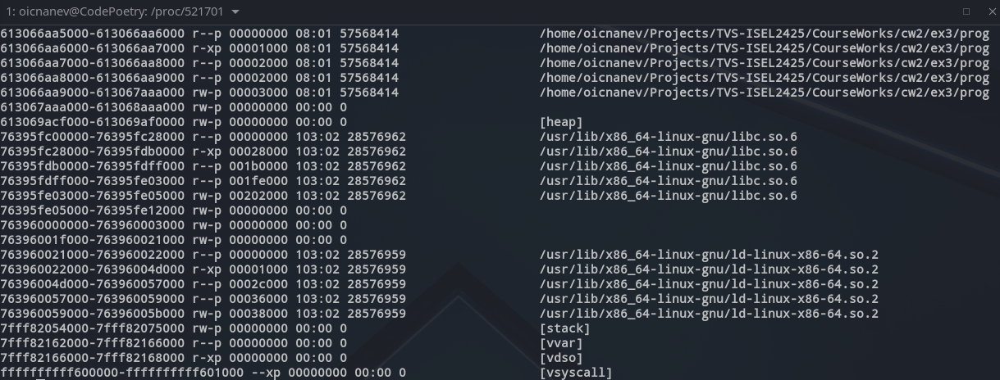
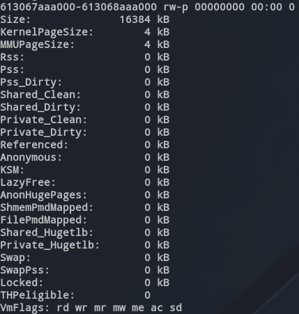
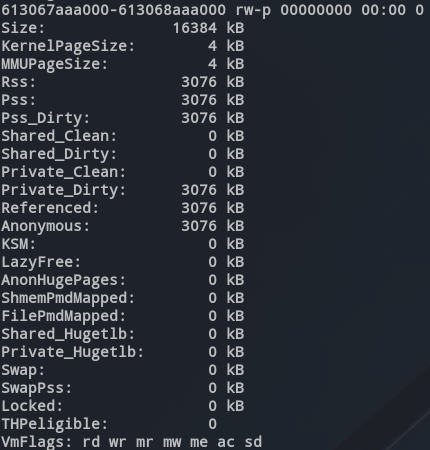
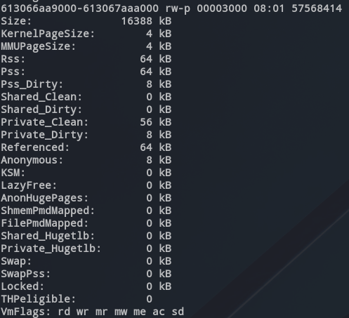
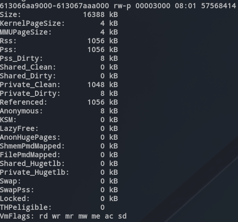
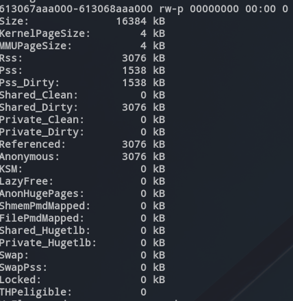
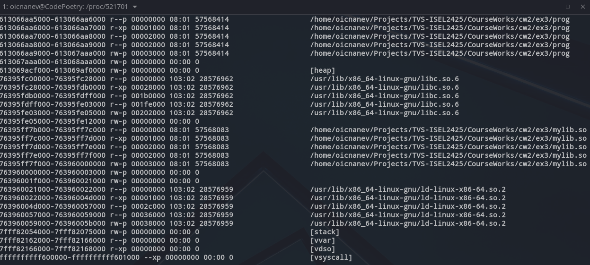
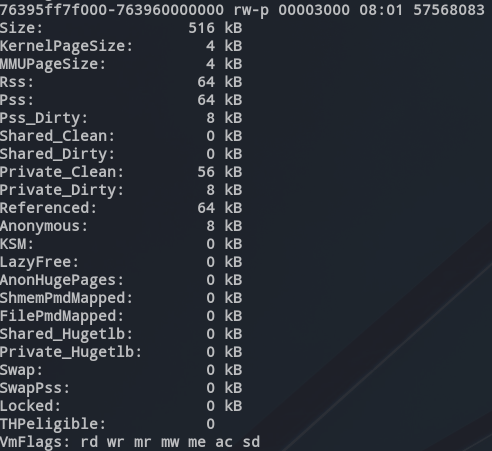
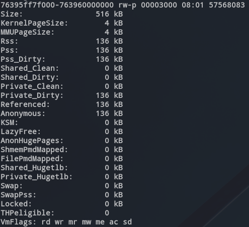

# Explicação:

## Mapeamento original - /proc/[pid]/maps



### prog

- HEADER
    * r--p (read-only)
    * 0x6130 66AA 5000 - 0x6130 66AA 6000
- .text
    * r-xp (read-only and executable)
    * 0x6130 66AA 6000 - 0x6130 66AA 7000
- .rodata
    * r--p (read-only)
    * 0x6130 66AA 7000 - 0x6130 66AA 8000
- .got (?) - (armazena endereços de variáveis globais e funções usadas)
    * r--p (read-only)
    * 0x6130 66AA 8000 - 0x6130 66AA 9000
- .data
    * rw-p (read and write)
    * 0x6130 66AA 9000 0x6130 67AA A000
- .bss
    * rw-p (read and write)
    * 0x6130 67AA A000 - 0x6130 68AA A000
- heap
    * rw-p (read and write)
    * 0x6130 69AC F000 - 6130 69AF 0000


## 1. **a. Increase the resident set (Rss) by about 3MB in the .bss region**:




```c
for (int i = 0; i < DATA_3MB; i++) {
    info[i] = 1;
};
```

Isto inicializa 3MB da `info` *array* na seção `.bss`, aumentando o RSS (resident set size).



## 2. **b. Access 256 bytes of initialized data (.data) with maximum impact in Private Clean pages**:



```c
int acumulator = 0;
for (int i = 0; i <= 256 * 4096; i += 4096) {
    acumulator += data[i];
};
```
    
Isto faz aceder a 256 bytes da *array*  `data` de 4KB em 4KB, com impacto nas páginas *Private_Clean*.



## 3. **c. Reduce the Pss of non-initialized data (.bss) to around 1.5MB for 30 seconds, while keeping Rss**:


    
```c
pid_t pid = fork();
if (pid == 0) {
    sleep(30);
    return 0;
} else {
    int status;
    waitpid(pid, &status, 0);
}
```
    
Ao criar um processo *child* dividimos o .bss por 2 processos, reduzindo assim o PSS ao mesmo tempo que se mantém o RSS.



## 4. **d. Execute a single operating system function that results in two new regions being added to the existing address space**:

Existem 4 formas de adicionar espaço à memória mapeada, nomeadamente, alocação (quando existem tantos `malloc` que é necessária mais memória), criação de `threads` (cria mais `stacks`), carregamento de bibliotecas dinâmicas a meio da execução através do `dlopen` e mapeamento de ficheiros através do `mmap`. 

Como devemos usar apenas uma operação e criar duas novas regiões, criamos uma biblioteca que tivesse `.text` e `.data`
	
```c
#define DATA_SIZE 512 * 1024 // 512KB for .data section

char data[DATA_SIZE] = {1};

void increase_128KB() {
  for (int i = 0; i < 128 * 1024; i++) {
    data[i] += 1;
  }
}
```
 
Para agilizar o processo de transformação em `.so`, linkagem e compilação do programa, criamos um *script bash*, que depois de `chmod +x compile.sh` podemos correr com `$ ./compile.sh`

```bash
#!/bin/bash

# Compile the shared library
gcc -shared -o mylib.so mylib.c -fPIC

# Compile the main program
gcc -o prog prog.c -ldl
```
    
Por fim no `prog.c` importamos dinâmicamente esta biblioteca com `dlopen`

```c
void *handle = dlopen("./mylib.so", RTLD_LAZY);
if (!handle) {
    printf("Erro ao carregar biblioteca: %s\n", dlerror());
    return 1;
}
```
    


São assim mapeadas regiões novas (mais de 2):



## 5. **e. Increase Private dirty pages by about 128KB in the region for the data section created in d)**:
    
```c
void (*increase_128KB)(void) = dlsym(handle, "increase_128KB");
const char *dlsym_error = dlerror();
if (dlsym_error) {
    printf("Error finding the function: %s\n", dlsym_error);
    dlclose(handle);
    return 1;
}
increase_128KB();
```
    


Para inicializar 128KB da nova região de dados mapeada, aumentando as páginas *Private_dirty*, basta chamar a função `increase_128KB` da biblioteca importada dinamicamente.



## Fim

Por fim fechamos a biblioteca carregada com:

```c
dlclose(handle);
```
