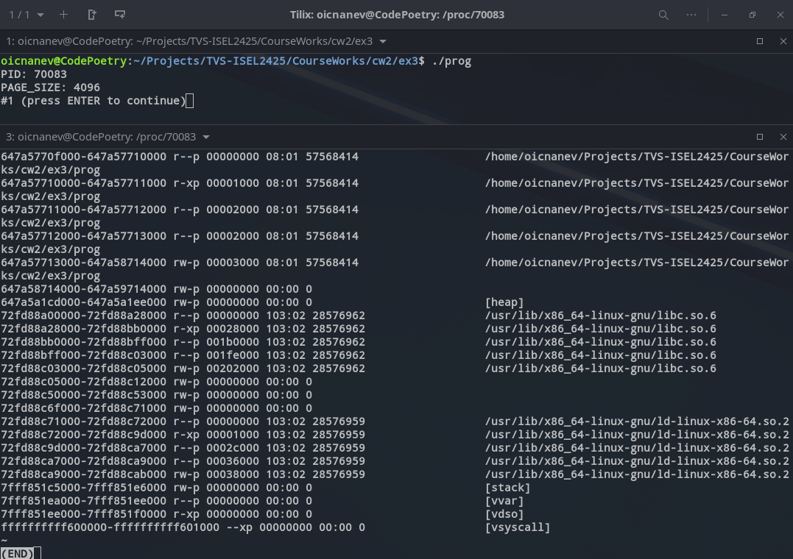
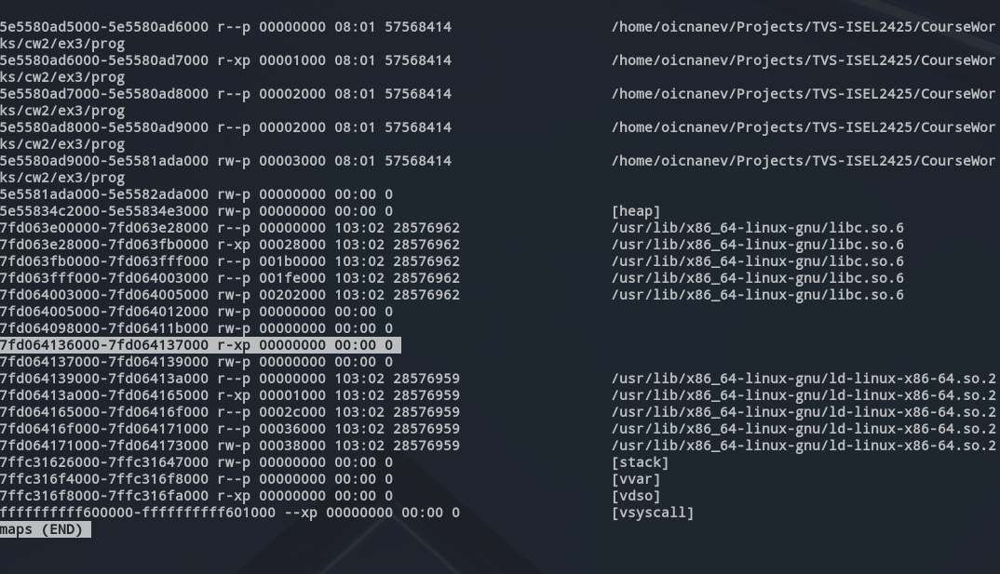

### Explanation of Changes:
1. **a. Increase the resident set (Rss) by about 3MB in the .bss region**:

```c
memset(info, 1, 3 * 1024 * 1024);
```

    - Isto inicializa 3MB da `info` *array* na seção `.bss`, aumentando o RSS (resident set size).

2. **b. Access 256 bytes of initialized data (.data) with maximum impact in Private Clean pages**:
    
```c
for (int i = 0; i < 256; i++) {
	data[i] = i;
}
```
    
    - Isto faz aceder a 256 bytes da *array*  `data` array, com impacto nas páginas *Private_Clean*.

3. **c. Reduce the Pss of non-initialized data (.bss) to around 1.5MB for 30 seconds, while keeping Rss**:
    
```c
madvise(info, 14.5 * 1024 * 1024, MADV_DONTNEED);
sleep(30);
```
    
    - Isto notifica o kernel que o *range* especificado da array `info` pode ser descartada, reduzindo o PSS ao mesmo tempo que mantém o RSS.

4. **d. Execute a single operating system function that results in two new regions being added to the existing address space**:
    
```c
void *code_region = mmap(NULL, PAGE_SIZE, PROT_READ | PROT_EXEC, MAP_PRIVATE | MAP_ANONYMOUS, -1, 0);
void *data_region = mmap(NULL, 512 * 1024, PROT_READ | PROT_WRITE, MAP_PRIVATE | MAP_ANONYMOUS, -1, 0);
```
    
    - Aqui são mapeadas 2 novas regiões: uma para for codigo (4KB) e outra para data (512KB).

5. **e. Increase Private dirty pages by about 128KB in the region for the data section created in d)**:
    
```c
memset(data_region, 1, 128 * 1024);
```
    
    - Isto inicializa 128KB da nova região de dados mapeada, aumntando as páginas *Private_dirty*.


### Execução do programa

1. **Início**

- HEADER 

```txt
5e5580ad5000-5e5580ad6000 r--p 00000000 08:01 57568414                   /home/oicnanev/Projects/TVS-ISEL2425/CourseWorks/cw2/ex3/prog
Size:                  4 kB
KernelPageSize:        4 kB
MMUPageSize:           4 kB
Rss:                   4 kB
Pss:                   4 kB
Pss_Dirty:             0 kB
Shared_Clean:          0 kB
Shared_Dirty:          0 kB
Private_Clean:         4 kB
Private_Dirty:         0 kB
Referenced:            4 kB
Anonymous:             0 kB
KSM:                   0 kB
LazyFree:              0 kB
AnonHugePages:         0 kB
ShmemPmdMapped:        0 kB
FilePmdMapped:         0 kB
Shared_Hugetlb:        0 kB
Private_Hugetlb:       0 kB
Swap:                  0 kB
SwapPss:               0 kB
Locked:                0 kB
THPeligible:           0
VmFlags: rd mr mw me sd 
```

- .text

```txt
5e5580ad6000-5e5580ad7000 r-xp 00001000 08:01 57568414                   /home/oicnanev/Projects/TVS-ISEL2425/CourseWorks/cw2/ex3/prog
Size:                  4 kB
KernelPageSize:        4 kB
MMUPageSize:           4 kB
Rss:                   4 kB
Pss:                   4 kB
Pss_Dirty:             0 kB
Shared_Clean:          0 kB
Shared_Dirty:          0 kB
Private_Clean:         4 kB
Private_Dirty:         0 kB
Referenced:            4 kB
Anonymous:             0 kB
KSM:                   0 kB
LazyFree:              0 kB
AnonHugePages:         0 kB
ShmemPmdMapped:        0 kB
FilePmdMapped:         0 kB
Shared_Hugetlb:        0 kB
Private_Hugetlb:       0 kB
Swap:                  0 kB
SwapPss:               0 kB
Locked:                0 kB
THPeligible:           0
VmFlags: rd ex mr mw me sd 
```

- .rodata

```txt
5e5580ad7000-5e5580ad8000 r--p 00002000 08:01 57568414                   /home/oicnanev/Projects/TVS-ISEL2425/CourseWorks/cw2/ex3/prog
Size:                  4 kB
KernelPageSize:        4 kB
MMUPageSize:           4 kB
Rss:                   4 kB
Pss:                   4 kB
Pss_Dirty:             0 kB
Shared_Clean:          0 kB
Shared_Dirty:          0 kB
Private_Clean:         4 kB
Private_Dirty:         0 kB
Referenced:            4 kB
Anonymous:             0 kB
KSM:                   0 kB
LazyFree:              0 kB
AnonHugePages:         0 kB
ShmemPmdMapped:        0 kB
FilePmdMapped:         0 kB
Shared_Hugetlb:        0 kB
Private_Hugetlb:       0 kB
Swap:                  0 kB
SwapPss:               0 kB
Locked:                0 kB
THPeligible:           0
VmFlags: rd mr mw me sd 
```

- .data

```txt
5e5580ad9000-5e5581ada000 rw-p 00003000 08:01 57568414                   /home/oicnanev/Projects/TVS-ISEL2425/CourseWorks/cw2/ex3/prog
Size:              16388 kB
KernelPageSize:        4 kB
MMUPageSize:           4 kB
Rss:                  64 kB
Pss:                  64 kB
Pss_Dirty:             8 kB
Shared_Clean:          0 kB
Shared_Dirty:          0 kB
Private_Clean:        56 kB
Private_Dirty:         8 kB
Referenced:           64 kB
Anonymous:             8 kB
KSM:                   0 kB
LazyFree:              0 kB
AnonHugePages:         0 kB
ShmemPmdMapped:        0 kB
FilePmdMapped:         0 kB
Shared_Hugetlb:        0 kB
Private_Hugetlb:       0 kB
Swap:                  0 kB
SwapPss:               0 kB
Locked:                0 kB
THPeligible:           0
VmFlags: rd wr mr mw me ac sd 
```

- .bss

```txt
5e5581ada000-5e5582ada000 rw-p 00000000 00:00 0 
Size:              16384 kB
KernelPageSize:        4 kB
MMUPageSize:           4 kB
Rss:                   0 kB
Pss:                   0 kB
Pss_Dirty:             0 kB
Shared_Clean:          0 kB
Shared_Dirty:          0 kB
Private_Clean:         0 kB
Private_Dirty:         0 kB
Referenced:            0 kB
Anonymous:             0 kB
KSM:                   0 kB
LazyFree:              0 kB
AnonHugePages:         0 kB
ShmemPmdMapped:        0 kB
FilePmdMapped:         0 kB
Shared_Hugetlb:        0 kB
Private_Hugetlb:       0 kB
Swap:                  0 kB
SwapPss:               0 kB
Locked:                0 kB
THPeligible:           0
VmFlags: rd wr mr mw me ac sd 
```

- heap

```txt
5e55834c2000-5e55834e3000 rw-p 00000000 00:00 0                          [heap]
Size:                132 kB
KernelPageSize:        4 kB
MMUPageSize:           4 kB
Rss:                   4 kB
Pss:                   4 kB
Pss_Dirty:             4 kB
Shared_Clean:          0 kB
Shared_Dirty:          0 kB
Private_Clean:         0 kB
Private_Dirty:         4 kB
Referenced:            4 kB
Anonymous:             4 kB
KSM:                   0 kB
LazyFree:              0 kB
AnonHugePages:         0 kB
ShmemPmdMapped:        0 kB
FilePmdMapped:         0 kB
Shared_Hugetlb:        0 kB
Private_Hugetlb:       0 kB
Swap:                  0 kB
SwapPss:               0 kB
Locked:                0 kB
THPeligible:           0
VmFlags: rd wr mr mw me ac sd 
```

- bliotecas .....
- stack

```txt
7ffc31626000-7ffc31647000 rw-p 00000000 00:00 0                          [stack]
Size:                132 kB
KernelPageSize:        4 kB
MMUPageSize:           4 kB
Rss:                  16 kB
Pss:                  16 kB
Pss_Dirty:            16 kB
Shared_Clean:          0 kB
Shared_Dirty:          0 kB
Private_Clean:         0 kB
Private_Dirty:        16 kB
Referenced:           16 kB
Anonymous:            16 kB
KSM:                   0 kB
LazyFree:              0 kB
AnonHugePages:         0 kB
ShmemPmdMapped:        0 kB
FilePmdMapped:         0 kB
Shared_Hugetlb:        0 kB
Private_Hugetlb:       0 kB
Swap:                  0 kB
SwapPss:               0 kB
Locked:                0 kB
THPeligible:           0
VmFlags: rd wr mr mw me gd ac 
```

2. Depois de `memset(info, 1, 3 * 1024 * 1024);`

- .bss com aumento de 3MB no RSS

```txt
5e5581ada000-5e5582ada000 rw-p 00000000 00:00 0 
Size:              16384 kB
KernelPageSize:        4 kB
MMUPageSize:           4 kB
Rss:                3072 kB
Pss:                3072 kB
Pss_Dirty:          3072 kB
Shared_Clean:          0 kB
Shared_Dirty:          0 kB
Private_Clean:         0 kB
Private_Dirty:      3072 kB
Referenced:         3072 kB
Anonymous:          3072 kB
KSM:                   0 kB
LazyFree:              0 kB
AnonHugePages:         0 kB
ShmemPmdMapped:        0 kB
FilePmdMapped:         0 kB
Shared_Hugetlb:        0 kB
Private_Hugetlb:       0 kB
Swap:                  0 kB
SwapPss:               0 kB
Locked:                0 kB
THPeligible:           0
VmFlags: rd wr mr mw me ac sd 
```

3. Aceder a 256 bytes do `.data` com impacto em Private_Clean pages

```txt
5e5580ad9000-5e5581ada000 rw-p 00003000 08:01 57568414                   /home/oicnanev/Projects/TVS-ISEL2425/CourseWorks/cw2/ex3/prog
Size:              16388 kB
KernelPageSize:        4 kB
MMUPageSize:           4 kB
Rss:                  64 kB
Pss:                  64 kB
Pss_Dirty:             8 kB
Shared_Clean:          0 kB
Shared_Dirty:          0 kB
Private_Clean:        56 kB
Private_Dirty:         8 kB
Referenced:           64 kB
Anonymous:             8 kB
KSM:                   0 kB
LazyFree:              0 kB
AnonHugePages:         0 kB
ShmemPmdMapped:        0 kB
FilePmdMapped:         0 kB
Shared_Hugetlb:        0 kB
Private_Hugetlb:       0 kB
Swap:                  0 kB
SwapPss:               0 kB
Locked:                0 kB
THPeligible:           0
VmFlags: rd wr mr mw me ac sd 
5e5581ada000-5e5582ada000 rw-p 00000000 00:00 0 
Size:              16384 kB
KernelPageSize:        4 kB
MMUPageSize:           4 kB
Rss:                3072 kB
Pss:                3072 kB
Pss_Dirty:          3072 kB
Shared_Clean:          0 kB
Shared_Dirty:          0 kB
Private_Clean:         0 kB
Private_Dirty:      3072 kB
Referenced:         3072 kB
Anonymous:          3072 kB
KSM:                   0 kB
LazyFree:              0 kB
AnonHugePages:         0 kB
ShmemPmdMapped:        0 kB
FilePmdMapped:         0 kB
Shared_Hugetlb:        0 kB
Private_Hugetlb:       0 kB
Swap:                  0 kB
SwapPss:               0 kB
Locked:                0 kB
THPeligible:           0
VmFlags: rd wr mr mw me ac sd 
```

4. Reduzir o PSS do .bss para 1.5MB durante 30 segundos

```txt
não vi diferença - deve estar mal
```

5. Executar operação de sistema que adicione duas novas regiões ao *address space*





6. Aumentar o Private_dirty por 128KB da área anterior

```txt
  # ORIGINAL

7fd064136000-7fd064137000 r-xp 00000000 00:00 0 
Size:                  4 kB
KernelPageSize:        4 kB
MMUPageSize:           4 kB
Rss:                   0 kB
Pss:                   0 kB
Pss_Dirty:             0 kB
Shared_Clean:          0 kB
Shared_Dirty:          0 kB
Private_Clean:         0 kB
Private_Dirty:         0 kB
Referenced:            0 kB
Anonymous:             0 kB
KSM:                   0 kB
LazyFree:              0 kB
AnonHugePages:         0 kB
ShmemPmdMapped:        0 kB
FilePmdMapped:         0 kB
Shared_Hugetlb:        0 kB
Private_Hugetlb:       0 kB
Swap:                  0 kB
SwapPss:               0 kB
Locked:                0 kB
THPeligible:           0
VmFlags: rd ex mr mw me sd 
```

```txt
# MODIFICADO

não vejo diferenças....
```

