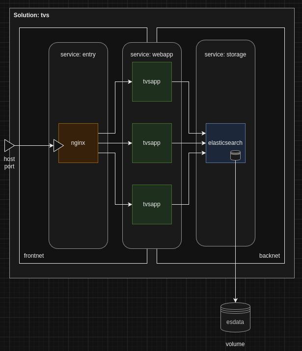

## Solution overview



## Step 1: Create folders for the webapp and nginx

Since the nginx and the tvsapp will be constructed from a docker image, we decide to create folders to organize the solution

```txt
.
├── docker-compose.yml
├── nginx
│   ├── Dockerfile
│   └── nginx.conf
└── WebApp
    ├── Dockerfile
    └── tvsapp
        └── app
            ├── files
            │   ├── isel.png
            │   ├── tvs.css
            │   └── tvs.png
            ├── package.json
            └── tvsapp.js
```

## Step 2: Create the docker-compose.yml file:

```yaml
name: "tvs"

services:
  entry:
    build:
      context: ./nginx
    depends_on:
      - webapp
    ports:
      - "2024:2024"
    networks:
      - frontnet

  webapp:
    build:
      context: ./WebApp
    depends_on:
      - storage
    environment:
      - ELASTIC_URL=http://tvs-storage-1:9200
    networks:
      - frontnet
      - backnet

  storage:
    image: elasticsearch:8.16.1
    environment:
      - discovery.type=single-node
      - xpack.security.enabled=false
    volumes:
      - esdata:/usr/share/elasticsearch/data
    #expose:
    #  - "9200"
    networks:
      - backnet

volumes:
  esdata:
    driver: local
    
networks:
  frontnet: {}
  backnet: {}
```


### Explanation

- **Services**:
	* **entry**: Uses the `nginx:alpine` image. It binds port 2024 on the host to port 2024 on the container and uses a modified configuration file. It depends on webapp.
	* **webapp**: Built from the Dockerfile in the `./tvsapp` directory. It sets the `NODE_PORT` environment variable, exposes port 8004, and depends on the `storage` service.
	* **storage**: Uses the `elasticsearch:8.16.1 image, sets the necessary environment variables, and mounts a volume to persist data.
- **Volumes**:
	* **esdata**: A named volume to ensure Elasticsearch data persistence.
- **Networks**:
    * **frontnet** a bridge network with an open port to the exterior and that connects the *entry* and *webapp* services
    * **backnet**: A bridge network not accessible from the exterior, connects the *webapp* and *storage*

### Default Nginx Configuration (default.conf)

For the file `nginx/default.conf and based on the given template:

```nginx
worker_processes 1;

events { 
    worker_connections 1024; 
}

http {
    include       mime.types;
    default_type  application/octet-stream;

    sendfile        on;
    keepalive_timeout  65;

    server {
        listen 2024;

        location / {
            proxy_pass http://webapp:8004;
            resolver 127.0.0.11 valid=5s;

            proxy_set_header Host $host;
            proxy_set_header X-Real-IP $remote_addr;
            proxy_set_header X-Forwarded-For $proxy_add_x_forwarded_for;
            proxy_set_header X-Forwarded-Proto $scheme;
        }
    }
}
```

This configuration file sets up Nginx to proxy requests to the `webapp` service using round-robin between the service containers.

We create a Dockerfile based on nginx:alpine:

```Dockerfile
FROM nginx:alpine

# Copy our nginx configuration
COPY nginx.conf /etc/nginx/nginx.conf

# Expose the 2024 port
EXPOSE 2024
```

## Access Control

- `entry` can access `webapp`.
- `webapp` can access `storage`.
- `entry` cannot directly access `storage` because there's no networking setup between them.

This setup will allow you to run the solution with a single port (2024) for all incoming requests, and allows the scaling of the number of `webapp` replicas without affecting the other services.

## Running the solution

To run the solution and ensure it uses all the replicas to process incoming requests, follow these steps:

### 1. Start the services:

```sh
docker compose up -d
```

### 2. Scale the webapp service:

```sh
docker compose up -d --scale webapp=4 --no-recreate
```

### 3.Confirm the solution is using all replicas:

```sh
seq 32 | xargs -I{} curl -s http://localhost:2024/ | grep "HOST" | sed "s/<\/\?[a-z]\+>//g" | sed "s/^[[:space:]]*//" | sort | uniq -c
```

Output example:

```sh
seq 32 | xargs -I{} curl -s http://localhost:2024/ | grep "HOST" | sed "s/<\/\?[a-z]\+>//g" | sed "s/^[[:space:]]*//" | sort | uniq -c
      8 HOST: 54774f6f1b68
      8 HOST: 763e4938f243
      8 HOST: b0400cae4cbf
      8 HOST: fc4d488fb4d0
```

## Additional Tasks

### 1. Check Service Logs:

```sh
docker compose logs -f
```

This command will follow the logs for all services in real time.

### 2. Run a Shell in Any Container:

```sh
docker exec -it <container_name> sh
```

Replacing `<container_name>` with the name of the container (e.g., `tvs-webapp-1`). Inside the container, you can get the IP address and observe the running processes:

```sh
docker exec -it tvs-webapp-1 sh
~/app $ ifconfig
eth0      Link encap:Ethernet  HWaddr 02:42:C0:A8:D0:05  
          inet addr:192.168.208.5  Bcast:192.168.223.255  Mask:255.255.240.0
          UP BROADCAST RUNNING MULTICAST  MTU:1500  Metric:1
          RX packets:520 errors:0 dropped:0 overruns:0 frame:0
          TX packets:25 errors:0 dropped:0 overruns:0 carrier:0
          collisions:0 txqueuelen:0 
          RX bytes:70198 (68.5 KiB)  TX bytes:4570 (4.4 KiB)

eth1      Link encap:Ethernet  HWaddr 02:42:C0:A8:E0:04  
          inet addr:192.168.224.4  Bcast:192.168.239.255  Mask:255.255.240.0
          UP BROADCAST RUNNING MULTICAST  MTU:1500  Metric:1
          RX packets:684 errors:0 dropped:0 overruns:0 frame:0
          TX packets:133 errors:0 dropped:0 overruns:0 carrier:0
          collisions:0 txqueuelen:0 
          RX bytes:90399 (88.2 KiB)  TX bytes:426424 (416.4 KiB)

lo        Link encap:Local Loopback  
          inet addr:127.0.0.1  Mask:255.0.0.0
          inet6 addr: ::1/128 Scope:Host
          UP LOOPBACK RUNNING  MTU:65536  Metric:1
          RX packets:4 errors:0 dropped:0 overruns:0 frame:0
          TX packets:4 errors:0 dropped:0 overruns:0 carrier:0
          collisions:0 txqueuelen:1000 
          RX bytes:265 (265.0 B)  TX bytes:265 (265.0 B)

~/app $ ps aux
PID   USER     TIME  COMMAND
    1 node      0:00 node tvsapp.js
   25 node      0:00 sh
   32 node      0:00 ps aux
~/app $ 
```

### 3. Demonstrate Connectivity and Unreachability:

- From `entry` to `webapp`:

```sh
/ # ping -c 4 tvs-webapp-1
PING tvs-webapp-1 (192.168.224.4): 56 data bytes
64 bytes from 192.168.224.4: seq=0 ttl=64 time=0.120 ms
64 bytes from 192.168.224.4: seq=1 ttl=64 time=0.146 ms
64 bytes from 192.168.224.4: seq=2 ttl=64 time=0.147 ms
64 bytes from 192.168.224.4: seq=3 ttl=64 time=0.173 ms

--- tvs-webapp-1 ping statistics ---
4 packets transmitted, 4 packets received, 0% packet loss
round-trip min/avg/max = 0.120/0.146/0.173 ms
```

- From `webapp` to `entry` and `storage`:

```sh
~/app $ ping -c 4 tvs-entry-1
PING tvs-entry-1 (192.168.224.6): 56 data bytes
64 bytes from 192.168.224.6: seq=0 ttl=42 time=0.123 ms
64 bytes from 192.168.224.6: seq=1 ttl=42 time=0.133 ms
64 bytes from 192.168.224.6: seq=2 ttl=42 time=0.143 ms
64 bytes from 192.168.224.6: seq=3 ttl=42 time=0.137 ms

--- tvs-entry-1 ping statistics ---
4 packets transmitted, 4 packets received, 0% packet loss
round-trip min/avg/max = 0.123/0.134/0.143 ms

~/app $ ping -c 4 tvs-storage-1
PING tvs-storage-1 (192.168.208.2): 56 data bytes
64 bytes from 192.168.208.2: seq=0 ttl=42 time=0.260 ms
64 bytes from 192.168.208.2: seq=1 ttl=42 time=0.126 ms
64 bytes from 192.168.208.2: seq=2 ttl=42 time=0.136 ms
64 bytes from 192.168.208.2: seq=3 ttl=42 time=0.137 ms

--- tvs-storage-1 ping statistics ---
4 packets transmitted, 4 packets received, 0% packet loss
round-trip min/avg/max = 0.126/0.164/0.260 ms
```

- Attempt from `entry` to `storage` (same as from storage to entry):

```sh
/ # ping -c 4 tvs-storage-1
ping: bad address 'tvs-storage-1'
/ #
```

## Nginx Configuration Explanation

1. **http://webapp:PORT is Enough to Reach All Replicas**:
	- In the `nginx` configuration, `upstream webapp { server webapp:8004; }` defines a backend group named `webapp` that points to the `webapp` service on port 8004. Docker's internal DNS will resolve `webapp` to all instances of the `webapp` service, distributing requests among them.

2. **Purpose of `resolver 127.0.0.11 valid=5s`**:
	- The line `resolver 127.0.0.11 valid=5s`; in the Nginx configuration is used to specify the DNS resolver for Nginx. `127.0.0.11` is the default DNS resolver provided by Docker, which resolves service names to their IP addresses. The `valid=5s` part means that the resolved IP addresses are considered valid for 5 seconds. This helps in dynamic environments where services may scale up or down, ensuring Nginx always uses up-to-date addresses for the `webapp` service.
